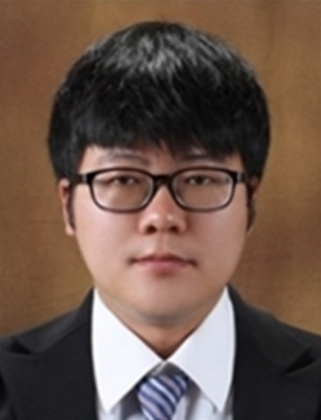

2016년도 8월 석사 졸업생인 윤동환 석사가 지난 6월 한국정보통신기술협회(TTA)에 취업하여 현재 소프트웨어시험인증연구소 항행안전시설 검증/인증TF 선임연구원로 재직 중입니다.

소프트웨어 시험인증 민간 비영리 단체인 TTA는 최근 항행안전시설에 대한 검증 및 인증 업무를 새롭게 수행하기 시작하고 있고, 항공우주시스템 개발 프로세스에 개발 및 인증 표준으로 자리매김하고 있는 ARP4754, ARP4761, DO-178/278 등을 개발 프로젝트에서부터 적용할 수 있도록 지원하는 업무도 준비하고 있습니다. 달탐사 프로젝트, 한국형 발사체 개발 등 항공우주시스템 개발에 대한 국가적 프로젝트가 지속적으로 진행되고 항공우주 소프트웨어에 대한 철저한 안전성 검증이 중요해지는 시점에, 항공우주전공 지식과 소프트웨어 능력을 동시에 갖춘 인재에 대한 수요가 크다는 것을 재차 확인할 수 있었고, TTA 내부에서도 윤동환 석사의 업무 능력에 대한 기대가 높다고 합니다.

2013년 학부 3학년부터 항법시스템 연구실에서 '학부연구생' 및 '석사과정 학생'으로 약 4년간 함께 연구를 수행한 윤동환 석사는 7개 연구프로젝트 참여, SCI(E) 주저자 논문 1편, 수상 4건 등 일반 석사과정으로는 도달하기 어려운 수준의 업적을 달성하였으며, 주요 연구 실적은 아래와 같습니다.

## 졸업 논문

다중경로오차 추정을 통한 위성 항법 기준국 관측환경 감시 방안 연구

**관심 분야:** D-GNSS, RTK(Real Time Kinematic), 항법 소프트웨어 개발/분석

## 참여 연구 과제 (7건)

1. WA-DGNSS 기준국 소프트웨어 검증기술 분석 및 시뮬레이션 (한국전자통신연구원)
2. AI 바이러스 포집기 GPS 위치 정확도 향상을 위한 후처리 소프트웨어 개발 (한국과학기술연구원)
3. RTK-GPS 기반 상대항법시스템 성능시험 및 분석 (한국항공우주연구원)
4. 유인기 공역내 드론의 통합 운용을 위한 저가형 GPS 수신기 무결성 정보 생성 연구 (국토교통과학기술진흥원)
5. GPS/GLONASS 보정정보 위치영역 매핑 엔진 개발 (국토교통과학기술진흥원)
6. 항체간 충돌방지를 위한 이동기준국 기반 위성항법 상대측위 연구 (한국연구재단)
7. 중앙처리국/통합운영국 운용시험평가 및 오프라인 감시를 위한 전략 수립 및 요소기술 분석 (한국항공우주연구원)

## 국내 저널 논문 (2건)

1. 박병운, 윤동환, "위성배치정보와 보정정보 맵핑 알고리즘을 이용한 저가형 GPS 수신기의 DGPS 서비스 적용 방안 연구", 한국항해항만학회지, 2014
2. 윤동환, 박병운, 최완식, 기창돈, 서승우, 박준표, "DO-278의 Validation & Verification에 적합한 WA-DGNSS 기준국 소프트웨어의 모듈별 통합 검증 방법론 제시", 한국항행학회논문지, 2015

## 국외 저널 논문 (3건, SCI(E)급 1건 포함)

1. Donghwan Yoon, Byungwoon Park, Ho Yun and Changdon Kee, "A Feasibility Test on the DGPS by Correction Projection Using MSAS Correction", JPNT, 2014
2. Hyojeong Seok, Donghwan Yoon, Cheol Soon Lim, Byungwoon Park, Seung-Woo Seo, Jun-Pyo Park, "Study on GNSS Constellation Combination to Improve the Current and Future Multi-GNSS Navigation Performance", JPNT, 2015
3. Donghwan Yoon, Changdon Kee, Jiwon Seo, Byungwoon Park, "Position Accuracy Improvement by Implementing the DGNSS-CP Algorithm in Smartphones", Sensor, 2016

## 국내 컨퍼런스 발표 (7건)

1. 윤동환, 박병운, 박흥원, 서승우, "항법위성의 NMEA 배치정보를 이용한 보정정보의 위치영역 맵핑 알고리즘 연구 및 DGPS 성능 비교", 2013 한국위성항법시스템 정기학술대회, 2013
2. 윤동환, 박병운, 최완식, 기창돈, "WA-DGNSS 기준국 소프트웨어 검증 기술 분석 및 시뮬레이션 연구", 2014 한국항행학회 정기학술대회, 2014
3. 윤동환, 박병운, 황호연, 서승우, 박준표, "통신 단절 후 Compact RTK 미지정수 재결정 시간 성능 연구", 2015 한국항행학회 정기학술대회, 2015
4. 신동현, 윤동환, 박병운, 황호연, "스마트기기에서 위성배치 정보를 활용한 DGNSS-CP와 DGPS-CP 성능비교", 2015 한국항행학회 정기학술대회, 2015
5. 임철순, 윤동환, 박병운, 조암, 유창선, "무인항공기 함상 이착륙 유도를 위한 GNSS 상대 정밀 측위기법 적용 가능성 연구", 2015 한국항행학회 정기학술대회, 2015
6. 윤동환, 신동현, 박병운, "스마트기기에 적용된 NMEA 위성배치정보를 활용한 DGNSS-CP 알고리즘 연구", 2015 한국위성항법시스템학회 정기학술대회, 2015
7. 신동현, 윤동환, 박병운, "위성배치정보를 활용한 DGNSS-CP 알고리즘 적용을 위한 스마트기기 내부 알고리즘 해석 연구", 한국정보통신학회 2016 추계 학술대회, 2016

## 국외 컨퍼런스 발표 (5건)

1. Byungwoon Park, Donghwan Yoon, Junesol Song, Changdon Kee, "Latency Compensation by Compact RTK Under Harsh Communication Environment of Land Transportation", ION GNSS+ 2014, 2014
2. Donghwan Yoon, Byungwoon Park, Wansik Choi, Changdon Kee, "Latency Compensation Performance of Compact RTK in 30s Time Delay Environment", ISGNSS 2014, 2014
3. Hyojeong Seok, Cheol Soon Lim, Donghwan Yoon, Byungwoon Park, "Annual prediction of multi-GNSS navigation performance in urban canyon", ISGNSS 2014, 2014
4. O-Jong Kim et al., "Navigation Augmentation in Urban Area with Pseudolite Equipped High Altitude Long Endurance UAV", ION ITM 2015, 2015
5. Byungwoon Park, Donghwan Yoon, Junesol Song, Changdon Kee, Seungwoo Seo, Junpyo Park, "Dynamic Test Result of the Compact RTK Under a Harsh Communication Environment of Land Transportation", ION Pacific PNT 2015, 2015

## 수상 내역 (4건)

1. 2013 KGS 우수논문상, 한국위성항법시스템학회, 2013. 11.
2. 제2회 학부생 논문 경연대회 장려상, 한국항공우주학회, 2014. 4.
3. 2015 한국항행학회 학술대회 우수논문상, 한국항행학회, 2015. 10.
4. 2015 Wearable Computer Contest 장려상, 한국차세대컴퓨팅협회, 2015. 11.

---

본 연구실의 졸업생인 윤동환 석사의 졸업과 취업을 진심으로 축하하며, 그 앞날에 무궁한 발전이 있기를 기도합니다.

## 후배들에게 보내는 글

> 안녕하세요. 항법시스템 연구실 첫번째 졸업생 윤동환 입니다. 현재 소프트웨어 시험인증 민간 비영리 단체인 TTA에서 현재 항행안전시설에 대한 검증 및 인증을 주요 업무로 진행하고 있습니다.
>
> 항법시스템 연구실에서 많은 프로젝트들과 개발 및 연구 프로세스를 경험하며 다양한 지식과 경험을 얻을 수 있던 점이 제 인생에 큰 기회가 될 수 있던 것 같습니다. 앞으로 대학원을 고민하고 있는 혹은 대학원에 진학할 예정인 후배님들에게 드리고 싶은 말은 모두 대학원에서의 시간은 전혀 낭비가 아니며, 스스로 발전할 수 있는 무궁한 기회가 있으니 스스로 발전을 위한 정말 좋은 기회라는 것 입니다. 맡은 프로젝트를 단순히 수행하기보다 좀 더 내가 참여하고 있는 프로젝트를 통해 내가 미래에 어떤 일을 할 것인가에 대해 초점을 맞추고 최선을 다한다면 결국엔 분명 좋은 결과를 얻을 수 있을 것이라 생각합니다. 후배님들 모두 도전을 두려워하지 말고, 미래의 자신에 도달하는 즐거운 꿈을 걸어갔으면 합니다.
