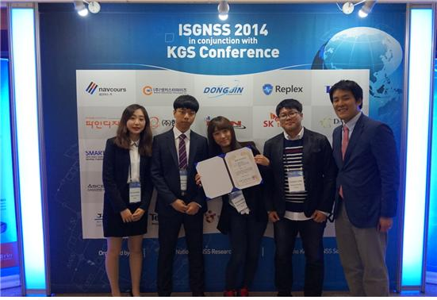

요즘은 스마트폰 지도 앱을 통해 쉽게 길을 찾을 수 있다. 하지만 고층빌딩이 많은 곳에서는 지도 앱이 실시간 위치를 잘못 알려줘 헤매는 경우가 많다. 위성항법시스템(GNSS)에서 오는 데이터가 고층빌딩에 의해서 방해받기 때문이다. 그렇다면 고층빌딩 사이에서도 정확한 위치를 실시간으로 알 수 있는 체계가 구축되려면 몇 년이 걸릴까?

미래 위성항법시스템 구축에 대해서 예측한 세종대학교 항공우주공학과 석효정(대학원·14) 학생의 논문이 한국위성항법시스템학회 정기 학술대회에서 우수논문상을 수상했다. 석효정 학생은 논문에서 '위성이 점차적으로 발사됨에 따라 그 성능 및 정확도가 향상될 것이며 2020년에는 서울 강남구에서도 정확한 정보를 얻을 수 있을 것이다'라고 전망했다.

이번 한국위성항법시스템학회의 학술대회에는 약 30편의 논문이 출제되었는데, 그중에 5편이 상을 받았다. 한국위성항법시스템학회는 2011년 12월 교육과학기술부 소관 사단법인으로 새롭게 출범하여 GNSS(Global Navigation Satellite System, 위성측위시스템)관련 학술과 연구개발 활동 및 기술정보교류를 촉진하는 대표적인 위성항법시스템 단체이다.

이번에 수상한 석효정 학생이 소속된 세종대학교 항법시스템 연구실(지도교수 박병운)은 2년이 채 안됐지만 매년 한국위성항법시스템학회에서 우수논문상을 수상할 만큼 이 분야에서 실력 있는 연구실로 자리매김하고 있다. 현재 항법시스템 연구실은 대학원생 2명, 학부생 2명으로 구성돼 있다.

석효정 학생은 "발표 때 준비한 것을 실수 없이 보여드려서 다행이라고 여겼는데, 이렇게 수상까지 하게 되어 기쁘다. 같이 밤새며 지도해주신 박병운 교수님께 감사드린다. 처음 참가한 이번 대회를 시작으로 남은 기간 동안 연구실에서 열심히 배우고 익혀 더 좋은 결과를 만들어 내겠다"라고 소감을 밝혔다.

---

*출처: 세종대학교 홍보실 | 취재 및 글: 김지원 홍보기자*
