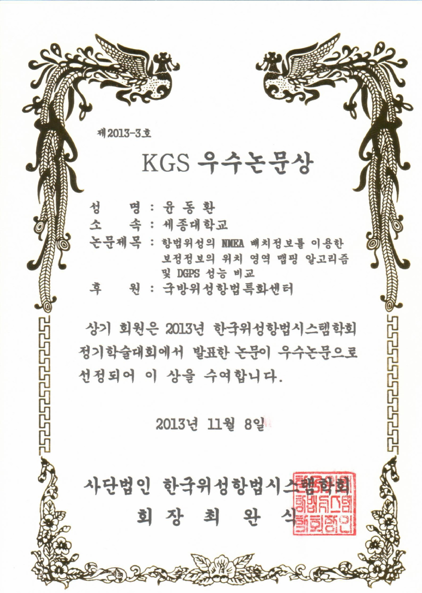

본 연구실에서 학부연구생으로 연구를 수행 중인 윤동환(항공우주공학과, 07)군이 한국위성항법시스템 학회 우수논문상을 수상하였다.

한국위성항법시스템 학회는 GNSS(Global Navigation Satellite System, 위성항법시스템)과 관련된 학술 교류와 연구개발 활동을 촉진하는 국내 유일한 위성항법시스템 학회로, 매년 산·학·연에서 수준 높은 논문이 발표되고 있다.

2013년에는 총 113편의 논문이 발표되었는데, 그 중 윤동환군은 유이하게 학부생 신분으로 발표를 하였으며, 선정된 총 5편 중 유일한 학부생 수상자였다.

윤동환군이 발표한 논문은 정확도 향상이 불가능한 저가형 GPS 수신기의 정확도를 새로운 알고리즘을 통해 향상시키는 내용으로, 향후 스마트폰, 카네비게이션의 성능을 크게 향상시킬 것으로 기대된다.
