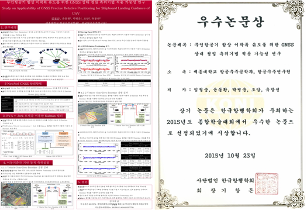

'2015년 한국항행학회 종합학술대회'에서 항공우주공학과 임철순(대학원·15), 윤동환(대학원·14) (지도 교수: 박병운) 학생이 우수논문상을 수상하였다. 10월 23일 열린 이번 학술대회에서는 'IoT 환경에서의 드론의 미래와 발전 방안'을 주제로 약 100건의 연구논문이 발표됐다.

박병운 교수와 임철순, 윤동환 학생은 '무인항공기 함상 이착륙 유도를 위한 GNSS 상대 정밀 측위기법 적용 가능성 연구'란 주제로 논문을 제출했다. 논문에서는 기상상황에 영향을 받는 영상기반 함상 이착륙 기술을 대신해 GNSS(Global Navigation Satellite System, 위성측위시스템)기반 무인항공기 함상 이착륙 기술의 적용 가능성을 검토하고 정확도를 높이는 방안을 제시하고 있어 큰 호평을 받았다.

이번에 수상한 박병운 교수의 세종대학교 항법시스템 연구실은 매년 각종 학술대회에서 우수논문상을 수상하며, 이 분야에서 실력 있는 연구실로 입지를 굳히고 있다.

임철순 학생은 "같이 밤새며 지도해주신 박병운 교수님과 항법시스템 연구실 구성원들에게 감사드린다. 최근, 인공위성과 무인항공기가 각광받으며 항법시스템분야가 함께 떠오르고 있다는 것을 느낀다. 많은 학생들이 항법시스템 분야에 관심을 가졌으면 좋겠다"라고 소감을 밝혔다.

---

*출처: 세종대학교 홍보실*
