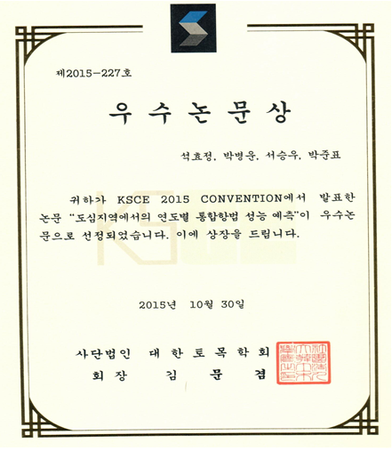

대한토목학회가 주관하고 한국건설관리학회, 한국수자원학회, 한국지반공학회, 한국측량학회가 공동 주최한 'KSCE 2015 학술대회'에서 항공우주공학과 석효정(대학원·14) 학생(지도교수·박병운)이 10월 30일 우수논문상을 수상하였다.

석효정 학생이 수상한 이번 학술대회는 전국 학계, 관계, 산업계 등 약 3,500명이 참석하였으며, 900여 편의 학술발표가 진행됐다. 동시에 71개 기관이 참가한 2015 CIVIL EXPO가 진행돼 큰 관심을 받았다.

석효정 학생은 '도심지역에서의 연도별 통합항법 성능 예측'이란 주제로 논문을 제출했다. 논문에서는 도심 고층건물 밀집지역 건물좌표를 이용하여 통합항법 수행 시의 가시성을 설명하고, 통합항법과 GPS 단독 측위의 성능차이를 시뮬레이션을 통해 비교 분석하였다. 석효정 학생은 논문을 통해 도심지 측량에 앞서 측위 가능 시간을 예측할 수 있는 지표를 제시했다는 점에서 큰 호평을 받았다.

석효정 학생은 "연구 진행과 발표까지 성공적인 마무리를 할 수 있도록 도와주신 박병운 지도교수님과 연구실 선배님들께 감사드린다. 이번 수상에 자만하지 않고 겸손한 마음가짐으로 남은 기간 연구실 생활에 매진하여 더 좋은 결실을 맺을 수 있도록 최선을 다하겠다"라고 소감을 밝혔다.

---

*출처: 세종대학교 홍보실*
