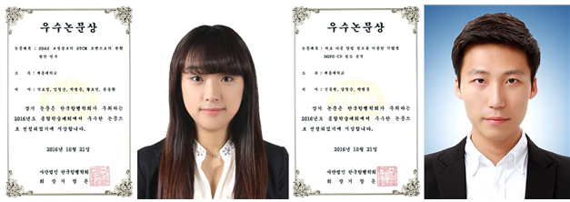

세종대 항공우주공학과 석효정(석사과정·14), 신동현(학부·11) 학생이 지난 10월 21일 한국과학기술회관에서 열린 2016년도 한국항행학회 종합학술대회에서 우수논문상을 수상하였다.

한국항행학회는 최근 IT산업에 새로운 성장 돌파구를 제공하고, 항공산업의 부가가치를 높이고 비용을 절감할 수 있는 항공 IT 융합 신산업의 발달에 맞춰 이번 학술대회를 개최했다. 세종대 항법시스템 연구실을 운영하고 있는 박병운 교수의 지도하에 연구실 소속 석효정, 신동현 학생은 그동안 수행했던 연구 결과를 공유하기 위해 학술대회에 참가했다.

석효정 학생은 공저자 임철순 연구원, 박병운 지도교수와 함께 'SBAS 보정정보의 RTCM 포맷으로의 변환 방안 연구'라는 논문을 발표했다. 항법의 정확도를 향상시키고자 하는 목적으로 GPS의 성능 향상을 위한 보강항법 시스템인 SBAS의 보강정보를 수신하여 SBAS 신호수신이 불가능한 지역에서도 보정정보 활용이 가능하도록 하는 시스템을 개발하였다. 저가형 수신기가 위치정확도를 향상시킬 수 있는 가능성을 지닌 연구로 높이 평가되었다.

신동현 학생은 공저자 임철순 연구원, 박병운 지도교수와 함께 '서로 다른 항법 정보를 이용한 기법별 DGPS-CP 성능 분석'이라는 논문을 발표했다. 해당 알고리즘을 구현하는 여러가지 방법의 특징 및 성능을 분석한 연구이다.

두 학생 모두 지금의 성적에 감사하지만 이에 자만하지 않고 더욱 노력하겠다는 소감을 밝히며 언젠가는 자신들이 쓴 논문이 국제학술지에 기재되기를 소망했다. 또한 "연구과정에 있어 선후배 간의 협업이 컸기에 동료 연구원들, 조언을 아끼지 않으신 박병운 지도교수님께 감사드린다"고 말했다.
