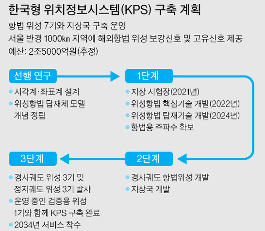
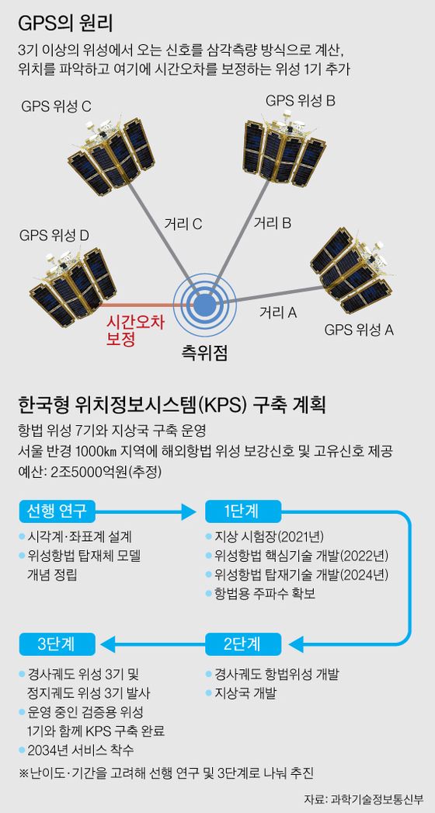

그간 미국 등 우주 선진국에 전적으로 의지해온 위성항법시스템(GPS)이 국내 기술과 자본으로 구축된다. 과학기술정보통신부는 다음달 5일 열릴 예정인 우주위원회에서 한국형 위성항법시스템(KPS) 구축을 포함한 제3차 우주개발진흥기본계획을 확정할 예정이다.

>"내달 5일 ‘KPS’ 계획 발표 예정
2조5000억 들여 2034년 완성
GPS 100% 해외의존서 벗어나고
오차 범위 10m서 1m 내로 줄어"

과기정통부에 따르면 한국형 위성항법시스템은 앞으로 3년 뒤인 2021년 지상 시험장 개발을 시작으로, 이듬해 위성항법 핵심기술개발, 2024년 위성항법 탑재기술개발 등의 과정을 거쳐 2034년 서비스를 시작한다. KPS 구축을 위해 정지궤도 위성 3기 등 총 7기의 항법위성이 발사·운용된다. 이를 통해 서울 반경 1000km 지역에 해외항법 위성 보강신호와 고유신호를 제공한다는 계획이다. 7개의 KPS를 구축하는데는 약 2조5000억원의 비용이 들 것으로 추정된다.

위성항법시스템은 흔히 'GPS'(Global Positioning System)로 불린다. 한국항공우주연구원에 따르면 GPS 위성을 받아 불편 없이 사용하려면 최소 4기의 위성이 머리 위에 있어야 한다. 또 위성항법시스템이 지구 전체를 커버하려면 최소 24기의 위성이 필요하다. 한국은 서울 반경 1000km을 권역으로 하는 지역항법시스템이기 때문에 7기만 있으면 된다는 게 항우연 측 설명이다.

GPS는 일상생활에서 필수 시스템이 된지 오래다. 자동차 네비게이션은 물론, 스마트폰과 항공기·선박 등의 위치정보가 모두 GPS 시스템에 의지한다. 하지만 한국은 자체 GPS위성이 없어 그간 미국 등 우주 선진국의 위성 GPS에 100% 의지할 수 밖에 없었다.

지금도 미국 GPS를 이용해서 아무런 불편이 없는데, 왜 2조5000억원이라는 예산을 투입해 한국형 위성항법시스템을 구축할까. 첫째 이유는 전쟁과 같은 위기 상황에 대한 대비다. 한반도 지역을 중심으로 전쟁이 발생할 경우 적군의 이용을 막기 위해 미국·러시아 등 GPS 보유 국가에서 신호를 차단할 수 있다.

허문성 한국항공우주연구원 위성항법팀장은 "GPS가 일상 생활 속 필수품이 된 시대에 어떤 이유로든 신호가 끊어진다는 것은 전국적 혼란을 의미한다"고 말했다.

한국형 위성항법시스템을 구축하면 GPS의 정확도가 올라가는 장점도 있다. 2034년 7개의 위성으로 구성된 KPS가 구축되면 현재 약 10m 안팎인 국내 GPS 시스템의 오차범위가 1m 미만으로 줄어들게 된다.

이 때문에 우주강국들은 앞다퉈 GPS 확보 경쟁을 하고 있다. 1978년 가장 먼저 시작한 미국은 현재 27기의 GPS 위성을 운용하고 있고, 러시아도 1982년부터 시작해 현재 24기를 확보하고 있다.

중국은 미국·러시아 등이 주도하는 위성 항법 시스템에 맞서고자 2000년부터 '베이더우(北斗)'라는 이름의 GPS 개발을 해오고 있다. 일본도 지난해 6월 초정밀 GPS 위성 '미치비키' 위성 2호기 발사하는 등 현재 4기의 GPS 위성을 보유하고 있다. 유럽연합(EU)도 2002년부터 '갈릴레오 프로젝트' 이름으로 GPS 구축을 시작했다.

항우연 허 팀장은 "다른 나라 위성에 의존했다가 생길 혼란을 막기 위해 선진국들은 앞다퉈 위성을 쏘아올려 'GPS 독립선언'을 하는 것"이라고 설명했다.

---

*출처: 중앙일보*
