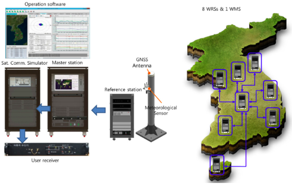

Korea will build its own navigation satellite system by 2034, providing independent positioning and navigation signals over an area spanning a 1,000-kilometer radius from the country's capital, Seoul.

The Ministry of Science and information and communications technology (ICT) announced that it would finalize a plan for the Korean Positioning System (KPS) at a Space Committee meeting on Feb. 5.

According to a preliminary statement from the Ministry of Science and ICT, the KPS initiative will develop a ground test in 2021, core satellite navigation technology by 2022 and begin actual satellite production in 2024. The system will comprise a total of seven navigation satellites, three of them geostationary above the Korean Peninsula.

Korea currently relies on the U.S. GPS system, which has suffered repeated local area jamming emanating from North Korea.

> "As the GPS becomes a necessity in everyday life, broken signals for any reason can set off a nationwide chaos," said an official for satellite navigation at the Korea Aerospace Research Institute (KARI).

Officials stated the the KPS will also improve available un-aided accuracy of GPS in its service area from about 10 meters now to less than one meter.

> "Advanced nations are trying to secure strong GPS capabilities by sending up satellites to prevent a chaos that can take place while they depend on other nations' satellites," stated the KARI spokesperson.

The initiative appears to be separate from the Korean Wide Area Differential GPS System, whose development was the subject of a 2011 paper presented at the Institute of Navigation (ION) International Technical Meeting. The abstract for that paper stated:

> "[The] project is scheduled for 2010 to 2014 under the contract with the Ministry of Land, Transport and Maritime affairs (MLTM). After that, Korea will launch a geostationary multifunctional satellite with a navigation payload which will be broadcasting augmenting signals for GPS."

In March 2016, the Korean Journal of Positioning, Navigation, and Timing published a paper titled "Performance Analysis of WADGPS System for Improving Positioning Accuracy," by Hyoungmin So, Jaegyu Jang, Kihoon Lee, Unpyo Park and Kiwon Song. Its conclusion section stated:

> "In this paper, configuration of observation reference stations and master station and initial experiment results were presented to verify accuracy correction performance of the WADGPS. The wide area correction algorithm was implemented using eight reference stations and one master station. For the initial performance verification, static and dynamic experiments were conducted. The experiment result showed that the static experiment had a horizontal accuracy performance with a level of 1 m (95 percent). In the dynamic experiment using a vehicle, performance degradation occurred compared to that of static experiment. The reason for this was due to the measured value error at the user receiver caused by multipath and visibility limitation. In summary, the implementation and performance of the algorithm of early stage were verified. For the future study, user operation characteristics will be considered and additional performance analysis on created correction information will be conducted."
