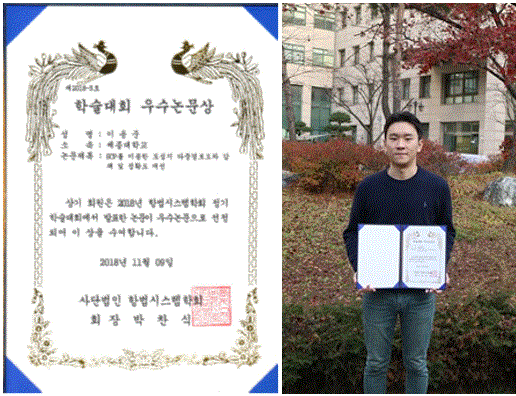

항공우주공학전공 이용준(15학번) 학생은 11월 7일부터 3일간 라마다 프라자 제주호텔에서 개최된 항법 시스템학회 정기학술대회에서 우수논문상을 수상했다.

이번 수상은 학술대회에 접수된 119편의 논문 중 5개의 우수논문에 선정된 것이며, 이용준 학생은 유일한 학부생 수상자이다.

이용준 학생의 논문은 'GCP를 이용한 도심지 다중 경로 오차 감쇄 및 정확도 개선'이다. 도심지 내 정확한 위치를 알고 있는 GCP(Ground Control Point)로부터 이중 주파수 신호 조합을 이용하여 다중 경로 오차를 확인하는 기법에 대해 다뤘다.

그는 강남 테헤란로에서 실시간으로 이동하는 차량에 적용하여 수평 5m 이내의 정확한 위치를 추정했다.

이번 연구 결과는 도심지와 같은 높은 건물들로 인한 위성 난수신 환경에서 IMU와 같은 부가적인 정보와 장비의 수반 없이 위치 결정 정확도를 크게 높이는데 기여할 것으로 기대된다.
