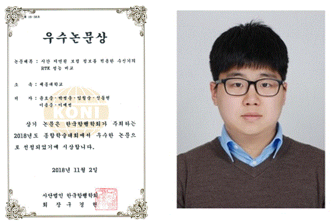

세종대 윤효중(대학원 항공우주공학과·18) 대학원생은 11월 2일 여의도 중소기업중앙회에서 개최된 한국항행학회 종합학술대회에서 우수논문상을 수상했다.

윤효중 대학원생의 논문은 '시간 지연된 보정 정보를 적용한 수신기별 RTK 성능 비교'이다. 그는 반송파를 이용해 cm급의 위치 정확도를 얻을 수 있는 기술인 RTK(Real Time Kinematics)에 사용되는 보정정보에 시간 지연이 발생하였을 때 수신기마다 RTK 성능의 차이에 대하여 연구했다.

윤효중 대학원생은 "많은 도움을 준 선후배 연구원들과 밤낮없이 조언과 지도해 주신 박병운 지도교수님께 감사하다. 앞으로 자율 주행과 드론의 기본인 항법 시스템에 대해 활발히 연구를 할 것이다"라고 말했다.

---

*취재: 백서율 홍보기자*
