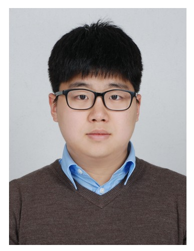

세종대 항법시스템연구실의 윤효중(대학원 석사과정 항공우주공학과·18) 대학원생은 지난 11월 1일 항법시스템학회가 주최한 ISGNSS conjunction with IPNT Conference에서 우수 논문상을 수상했다.

윤효중 대학원생은 **'다양한 조건에서의 RTK MSM 보정정보 스케쥴링 영향에 관한 연구'**를 주제로 발표했다.

윤효중 대학원생은 제한된 대역폭을 효과적으로 활용하기 위해 RTK에 사용되는 MSM 보정정보를 스케줄링하여 적용하였고, 다양한 측위 환경에서의 스케줄링 된 보정정보의 실제 사용 가능성을 확인하였다.

윤효중 대학원생은 "조언을 아끼지 않고 지도해주신 박병운 지도교수님과 연구에 도움을 준 선후배 연구원들에게 감사하다"라고 말했다.

현재 윤효중 학생은 대학원의 항법시스템연구실에서 연구하고 있으며 2018년 한국항행학회에 이어 **2년 연속**으로 국내 주요 학회에서 우수논문상을 수상하였다.

또한 세종대 항법시스템연구실은 GNSS 관련 분야에 대한 연구를 주로 수행하고 있으며, 항법시스템학회에서 2년 연속 수상하고 있다.
