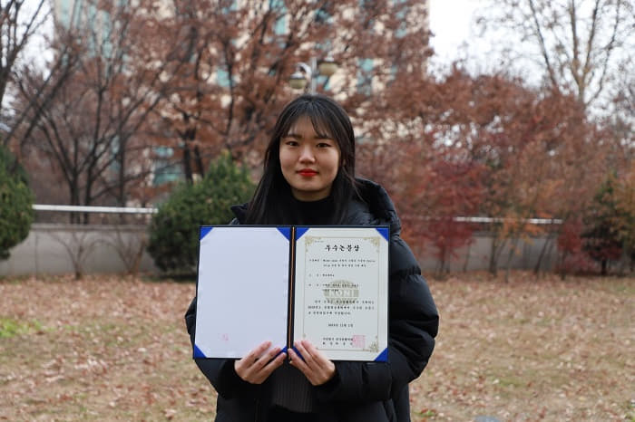

세종대 항법시스템연구실의 이예빈(대학원 석사과정 항공우주공학과·19) 대학원생은 지난 11월 1일 열린 2019 한국항행학회에서 우수논문상을 수상했다.

이예빈 대학원생은 **'Wide-lane 측정치 조합을 이용한 Cycle slip 검출 및 위치 결정 기법 제안'**에 대한 논문을 발표했다.

이예빈 대학원생은 MW/EMW 조합에서 검출하지 못하는 Cycle slip의 영향을 보완하기 위해 위치 결정시 Wide-lane 측정치를 사용함으로써 위치 해의 신뢰성을 높일 수 있는 방안을 제안했다.

이예빈 대학원생은 "많은 조언과 도움을 주신 박병운 지도교수님과 연구실 동료들에게 감사드린다. 이번 학술대회 연구 주제를 기반으로 더 좋은 연구 결과를 낼 수 있도록 노력하겠다"라고 말했다.

세종대 항법시스템연구실은 GNSS 관련 분야에 대한 연구를 주로 수행한다. 항법시스템연구실은 한국항행학회에서 **6년 연속 수상** 실적을 쌓게 되었다.
