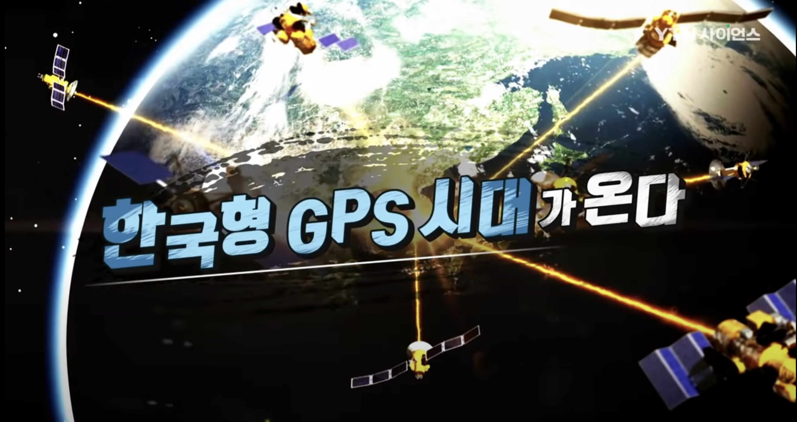

오늘날 우리 일상에서 내비게이션, 스마트폰 위치 서비스 등 GPS(위성항법시스템)가 없는 삶은 상상하기 어렵습니다. 하지만 우리가 무상으로 당연하게 사용하는 이 서비스는 사실 미국의 자산입니다. 만약 국제 정세의 변화로 미국이 서비스를 중단하거나 유료화한다면 국가 안보와 경제는 순식간에 마비될 수밖에 없습니다. 이에 대한민국은 독자적인 위성항법시스템인 'KPS(Korean Positioning System)' 구축을 통해 진정한 '우주 기술 독립'에 박차를 가하고 있습니다.

위성항법시스템은 단순한 길 안내를 넘어 국가 안보와 경제의 핵심 인프라입니다. 현재 전 세계는 자국의 시스템을 보유하기 위해 치열한 전쟁을 벌이고 있습니다. 미국의 GPS에 대응해 러시아는 글로나스, 유럽연합은 갈릴레오를 운영 중이며, 중국은 최근 26년 만에 베이더우를 완성하며 전 세계 서비스를 시작했습니다. 이들이 막대한 예산을 투입하는 이유는 안보와 주권 때문입니다. 위성항법은 정밀 타격 무기와 군사 정보 통신 능력을 좌우하는데, 동맹국이라 할지라도 핵심 군사용 신호는 제한적으로만 제공되기에 국방 자립을 위해서는 독자 시스템이 필수적입니다.

대한민국이 추진하는 KPS는 한반도 상공에 항법 위성을 배치하여 서울 반경 1,000km 지역에 오차 범위 1m 미만의 초정밀 위치 정보를 제공하는 것을 목표로 합니다. 정부는 단계별 계획을 통해 2027년 첫 위성 발사를 시도하고, 2035년까지 시스템 구축을 완료하여 본격적인 대국민 서비스를 개시할 예정입니다. KPS가 성공적으로 구축될 경우 약 12조 7,000억 원의 경제적 파급 효과가 기대됩니다. 특히 자율주행차, 도심항공모빌리티(UAM), 스마트 물류 등 4차 산업 혁명의 핵심 기술들이 모두 정밀한 위치 정보에 기반하는 만큼, KPS는 미래 산업의 강력한 엔진이 될 전망입니다.

KPS 완성 전까지 정부는 기존 GPS의 오차를 줄이는 기술도 병행 발전시키고 있습니다. GPS의 10m급 오차를 3m 이내로 줄여 항공기 이착륙 등에 활용하는 위성 기반 보정 시스템 'KASS(카스)'와, GPS 전파 교란이나 해킹 상황에 대비해 지상파를 이용한 안정적인 항법 정보를 제공하는 '로란-C' 등이 대표적입니다. 이러한 다각적인 노력은 우리 국민의 안전을 지키는 든든한 방패가 됩니다.

전문가들은 우주 기술 확보가 곧 국력인 시대라고 입을 모읍니다. 독자적인 위성항법시스템 구축은 단순히 위치 정보를 얻는 것을 넘어, 우리나라의 첨단 산업을 한 단계 업그레이드하고 국제 사회에서의 위상을 높이는 밑거름이 될 것입니다. 대한민국이 우주와 지상을 잇는 자체 기술로 그려낼 정밀한 미래가 머지않았습니다.
