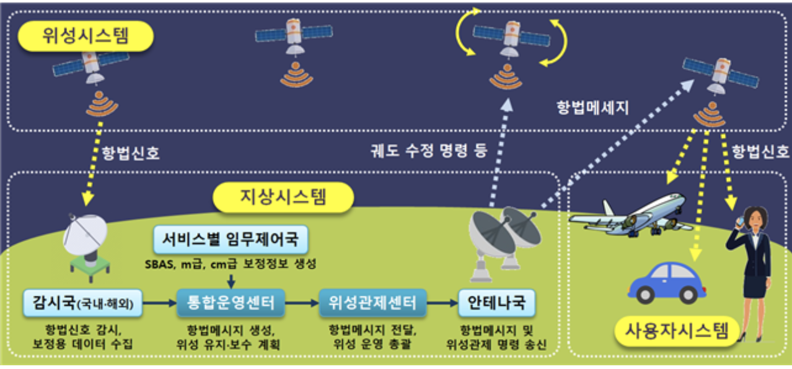
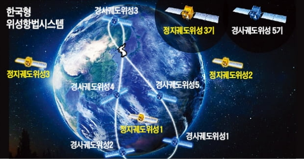

## 내년 첫발 떼는 한국형 GPS, 자율車·플라잉카 토대 닦는다

운전을 하다 보면 내비게이션이 엉뚱한 길로 안내하거나 가까운 거리를 굳이 먼 길로 돌아가라는 경우가 많다. 지도 소프트웨어 업데이트가 안 됐거나, 전지구 위성항법시스템(GNSS)의 오차 때문이다. GNSS를 보유한 국가는 미국(GPS), 러시아(글로나스), 중국(바이두) 세 곳이다. 모두 이들 국가의 GNSS를 빌려 쓰기 때문에 지역마다 오차가 생긴다. GPS의 오차는 최대 20m에 달한다.

이런 오차를 cm 단위까지 줄이는 **'한국형 위성항법시스템(KPS)'** 사업이 내년부터 시작된다. 정지궤도 위성 3기, 경사궤도 위성 5기 등 총 8기 위성을 발사해 한반도 인근에 초정밀 지역항법시스템을 구축하는 사업이다. 자율주행차, 플라잉카(도심항공모빌리티)의 핵심 인프라다.

과학기술정보통신부는 25일 KPS 예비타당성조사를 통과시켰다. 내년부터 2035년까지 3조 7,234억원이 투입될 예정이다. 2027년 첫 위성 발사를 시작으로 2035년까지 위성 8기를 발사한다. 과기정통부를 비롯해 국토교통부, 해양수산부, 해양경찰 등 관계부처가 참여한다.

현재 미국이 운영 중인 GPS 위성 개수는 31개다. 이들 위성이 지상 수신국(안테나)과 수신기(차량, 선박, 비행기 등)의 좌표를 토대로 항법시스템을 구성한다. 예를 들면 차량 A에서 목적지로 B를 내비게이션에 찍으면, 위성이 A와 B 인근 수신국에 전파를 보내고 받는 시간과 거리를 수학적으로 계산해 위치정보를 표기한다. 이 과정에서 지구 자전 등 우주환경 때문에 생기는 위성의 시간과 궤도 오차를 보정해야 한다. 이때 아인슈타인의 상대성이론이 사용된다.

현재 GNSS를 보완하는 자체 지역항법시스템을 둔 곳은 인도가 유일하다. 일본은 2023년 구축 예정이다. KPS 사업이 2035년께 마무리되면 국제민간항공기구(ICAO)가 권하고 있는 항법보강시스템(SBAS)도 자연스럽게 구축된다. 현재 한국은 항공기 이·착륙과 선박 운항 시 충돌 방지 정보를 제공하는 SBAS를 외국에 의존하고 있다. 자체 SBAS 시스템을 가진 나라는 미국, 유럽, 일본, 인도, 러시아, 중국이다.

항공우주업계에 따르면 위성항법시스템 관련 국내 산업 규모는 2035년 50조원, 아시아태평양 시장은 400조원에 달할 것으로 예상된다. KPS는 고용유발 효과 6만 명, 생산유발 효과 8조원을 낼 것으로 전망됐다. LIG넥스원, AP위성, 단암시스템즈, ACE테크놀로지스, 한컴인스페이스 등이 KPS 사업에 참여할 예정이다.

과기정통부는 KPS 위성 8기 외에도 2031년까지 초소형 위성 100여 기를 발사할 예정이다. 군사·정찰용 50여 기, 6세대(6G) 이동통신 기술 검증용 14기, 우주 전파환경(태양풍 등) 관측용 22기, 심우주 탐사·우주쓰레기 제거 등 기술 확보용 13기 등이다. 세계 초소형 위성 산업 규모는 2014년 7억달러에서 2019년 15억달러로 연평균 17% 성장했다. 일론 머스크가 창업한 스페이스X가 전지구 인터넷망을 구축한다며 쏘아 올리고 있는 1만 2,000여 기 위성도 초소형 위성의 일종이다.

*출처: 한국경제신문, 이해성 기자*
