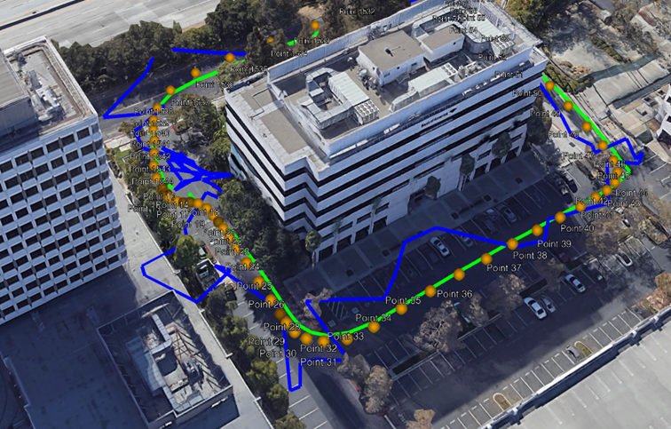
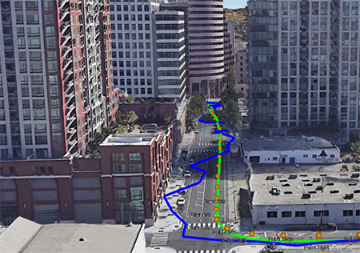

세종대학교(총장 배덕효) 항공우주공학과 박병운 교수 연구팀은 지난 7월 29일 구글이 주최한 'Smartphone Decimeter Challenge 2022'에서 국내 기관 중 유일하게 금메달을 수상했다.

국제 위성 항법 시스템 학회인 Institute of Navigation과 구글이 공동 주관한 'Smartphone Decimeter Challenge'는 스마트폰 위치를 정확하게 측정하는 대회이다. 올해로 2회 차인 이번 대회에는 미국, 일본, 중국 등 전 세계 위성 항법 시스템 연구자 총 571팀이 참여했다.

현재 스마트폰의 위치를 계산하기 위해 사용되는 GNSS 칩셋은 개방된 도로 기준 5-10미터 수준의 정확도를 가진다. 또한 건물 등의 장애물이 많은 도심지의 경우 20-100미터 이상으로 오차가 발생한다.

박 교수 연구팀은 구글이 제공한 미국 캘리포니아 일대의 스마트폰 주행 데이터를 활용해 개방된 도로 기준 1미터 이하의 오차 수준으로 위치 정확도를 확보하여 대회 취지에 적합한 목표를 달성했다. 더 나아가 도심에서도 3미터 이하의 위치 정확도를 확보하여 스마트폰의 활용 가능 범위를 확대했다.

연구팀의 팀장 윤정현 박사과정생은 "세계 각국의 뛰어난 연구진들과 치열한 경쟁 속에 좋은 결과를 얻게 되어 매우 영광이다. 연구에 아낌없는 조언과 헌신적인 도움을 준 박병운 지도 교수님과 대회 준비에 최선을 다해준 팀 동료 및 연구실 동료들에게 감사하다"라고 말했다.

박 교수는 "위치항법은 손 안의 스마트폰으로부터 우주의 발사체와 위성에 이르기까지 우리 삶에 깊숙이 자리 잡고 있다. 이번 대회에서의 쾌거가 올해 개발에 착수한 한국형 위성항법시스템 KPS의 활용가치 제고에 크게 기여할 것으로 예상된다. 스마트폰 글로벌 시장을 석권하고 있는 국내 제조회사의 경쟁력 강화에도 일조할 것으로 기대한다"라고 밝혔다.

한편 박 교수 연구팀은 이번 대회에서 확보한 위성항법 기술을 과학기술정보통신부 연구재단 주관의 '미래 우주항법 및 위성기술 연구센터' 사업과 연계하여 달에서 활용 가능한 위성항법시스템 연구로 확대할 계획이다.

