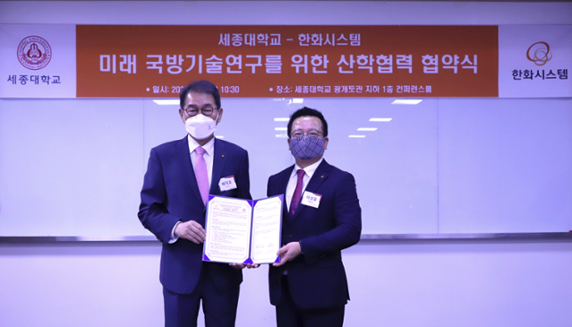

세종대학교(총장 배덕효)는 지난 25일 광개토관 지하 1층 컨퍼런스룸에서 한화시스템과 미래 국방기술 연구를 위한 산학협력 협약식을 진행했다.

이번 협약식은 세종대와 한화시스템 간에 연구 개발 인력양성 등 다양한 분야에서의 협력을 강화하기 위해 추진됐다.

한화시스템은 첨단 방산전자와 IT분야의 스마트 기술을 갖춘 글로벌 토털 솔루션 기업으로 공공산업과 민수산업에서 4차 산업혁명시대의 혁신을 선도한다. 한화시스템은 특히 육·해·공·우주·사이버를 아우르는 첨단기술을 바탕으로 스마트 국방에 중점을 두고 있다.

이날 협약식은 배덕효 총장, 엄종화 부총장, 한화시스템 어성철 대표이사 등 18명이 참석한 가운데 진행됐다.

이번 협약을 통해 세종대와 한화시스템은 항공우주, 레이다, 사이버, 인공지능 사업 분야와 4차 산업혁명 관련 국방 기술 산학 네트워크를 구축하고 기술개발과 우수 인재 확보를 위한 교육 협력체계를 마련한다.

배 총장은 "국방우주 시스템이 전 세계적으로 주목 받고 있는 가운데 한화시스템과 협약을 맺게 되어 기쁘다. 한화시스템과 함께 우주산업분야에서 국내 최고가 되도록 노력하겠다. 많은 연구를 통하여 양 기관의 발전을 넘어 국가 전체의 발전으로 이어지길 바란다"라고 말했다.
