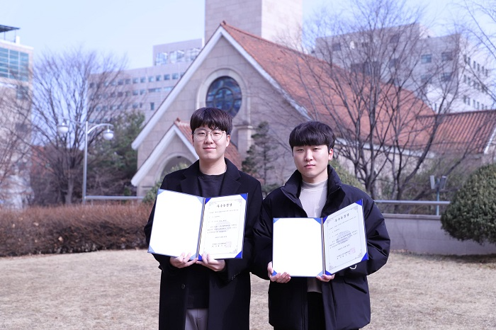

항공우주공학전공 조용래(16) 학생과 김수열 대학원생(22)은 한국항행학회 종합학술대회에서 우수논문상을 수상했다.

한국항행학회는 항행 관련 분야의 학술교류와 연구활동을 펼치고 국가항행 분야의 발전을 선도하는 학회이다. 매년 정기적으로 학술대회를 개최해 항행에 관련된 최신 연구결과를 발표한다.

이번 종합학술대회는 '4차 산업혁명 ICT 신기술 기반 항행 시스템의 미래'를 주제로 진행됐다.

조용래 학생은 '안테나 보정을 이용한 반송파 이중차분 분석' 논문을 작성했다. 조 학생은 안테나 모델을 활용해 위성 위치에 대한 반송파 측정치를 보상한 후 이중차분 잔차값을 산출했다. 산출값을 기반으로 성공적으로 이중차분 성능을 분석했다.

김수열 대학원생은 '웹기반 GNSS 후처리 서버 구축 및 결과 분석' 논문을 발표했다. 기존의 프로그램 기반 후처리 방식의 단점을 보완하고자 연구를 진행했다. 김 학생은 정밀 측위 산출 후처리 알고리즘을 개발해 누구나 손쉽게 후처리를 가능하게 했다.

조용래 학생은 "많은 조언과 도움을 주신 박병운 지도교수님과 연구실 동료들에게 감사드린다. 이번 학술대회 연구주제를 기반으로 좋은 연구결과를 낼 수 있도록 노력하겠다"라고 말했다.
