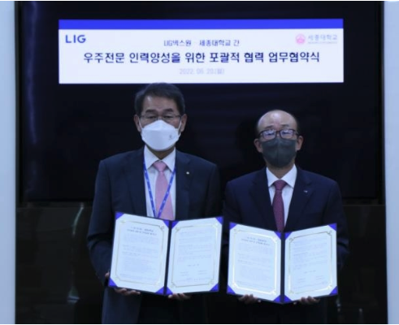

LIG넥스원이 세종대와 미래 우주 분야 신기술 개발을 선도할 전문인력 양성에 나선다.

LIG넥스원은 20일 경기 성남시 판교R&D센터에서 김지찬 LIG넥스원 대표이사와 배덕효 세종대 총장 등이 참석한 가운데 세종대와 '중·장기적인 우주전문 인력 양성'을 위한 업무협약(MOU)을 체결했다고 21일 밝혔다.

이번 협약을 통해 LIG넥스원과 세종대는 우주 분야 신기술 개발, 교육 콘텐츠 및 연구 인프라 공동 활용, 우주 관련 위탁·공동 연구 추진, 현장 실무형 인력양성을 위한 인턴쉽 및 인적교류 등에 대해 협력하기로 했다.

세종대는 전국에서 유일하게 과학기술정보통신부의 '미래우주교육센터'와 방위사업청의 '방위산업 계약학과 지원사업' 주관대학으로 동시 선정된 대학이다.

김지찬 LIG넥스원 대표이사는 "위성용 영상 레이다, 위성항법, 우주감시 등 우주작전 수행의 기틀을 마련하고, 국가 우주개발계획 수립에 필요한 기업 맞춤형 인재 양성을 위해 최선을 다하겠다"고 말했다.
