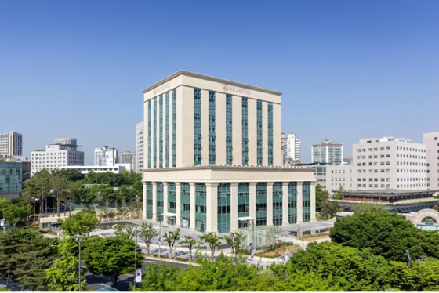

세종대학교(총장 배덕효)는 과학기술정보통신부(이하 과기정통부)의 '미래우주교육센터'와 방위산업청(이하 방사청)의 '방위산업 계약학과 지원사업' 주관대학으로 동시에 선정됐다. 상기 두 사업에 동시 선정된 대학은 전국에서 세종대학교가 유일하다.

뉴스페이스(New Space)시대의 도래에 따라, 민간과 국방, 양 분야에서 모두 국내 우주개발의 수요가 급증하고 있다. 새로운 시대의 민군 수요를 반영하여 우주산업의 기틀을 마련하고 국가적으로 수립된 우주개발계획을 차질 없이 진행하기 위해서는 우주 분야의 기업이 필요로 하는 전문인력의 공급이 적시에 이루어져야 하는데, 국내 교육의 현주소는 그렇지 못한 실정이다.

세종대에 설립될 과기정통부의 '미래우주교육센터'는 석·박사 과정 학생들에게 미래우주기술을 집중 교육함으로써 국내 우주 인재를 양성하고 관련 산업 경쟁력을 강화하는 것을 목적으로 한다. 특히 우주항법과 위성기술 연구를 통해 미래 우주분야에서 중요한 항법 인프라 구축에 기여하고, 융합기술을 선도하며 우주산업 생태계 활성화에 중요한 계기가 될 것으로 기대된다.

또한 방사청의 방위산업 계약학과 지원사업을 통해 세종대는 우주분야 교수진과 현재 보유 중인 연구 인프라를 기반으로 일반대학원 내에 '국방우주공학과'를 신설할 예정이다. 이를 바탕으로 국방부에서 추진 예정인 우주감시체계, 초소형위성체계, 위성항법체계 등 국방우주전력 사업추진과 미래 국방우주력 건설에 요구되는 궤도전 기술, 우주발사체, 레이저 통신기술 등 미래지향적 교육과정 및 연구프로젝트 수행을 통해 방위산업 맞춤형 석·박사 전문인력을 양성할 계획이다.

한편 우주항공분야의 학부 교육 내실화를 위해서도 기존의 우주항공공학과와 공군의 계약학과인 항공시스템공학과를 '우주항공시스템공학부' 체제로 통합 개편한다. 위와 같이 세종대는 첨단 미래 우주항공기술 연구인력, 기업 맞춤형 국방우주 산업인력, 공군의 정예 조종사인력의 양성 등 세 마리 토끼를 한 번에 잡을 수 있는 명실상부한 국내 유일의 실사구시형 우주항공 전문인력 양성의 메카로 발돋움하겠다는 포부를 가지고 있다.
