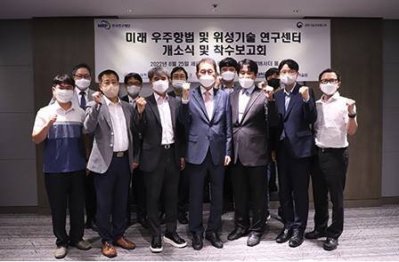

세종대학교(총장 배덕효)는 지난 25일 광개토관 516호 엠버서더홀에서 미래 우주항법과 위성기술 연구센터 개소식을 진행했다.

연구센터는 미래 우주위성항법 연구와 미래우주 전문인력 양성을 위해 설립됐다.

연구센터는 미래 우주위성항법을 구성하는 초소형 위성, 달 환경에서의 위성궤도결정 등 미래 우주 핵심 요소기술과 시스템 체계 기술 개발을 목표로 한다. 연구센터는 인재 양성을 위해 연계 교육 프로그램 활성화, 미래 우주 신기술 심화 교과목 개발 등을 진행할 계획이다.

연구센터는 세종대, 서울대, 연세대, 홍익대, 한국과학기술원(KAIST)의 5개 대학이 주도한다.

개소식에는 배덕효 총장, 백성욱 연구부총장, 홍우영 교무처장 등 13명이 참석한 가운데 진행됐다.

배 총장은 "모두가 각자의 연구에 충실히 임해 좋은 연구결과를 얻을 수 있으면 좋겠다. 연구센터가 몇 년의 사업으로 끝나지 않는 지속적인 사업이 되길 바란다. 우리 대학이 할 수 있는 일이 있으면 최대한 지원하겠다"라고 말했다.
