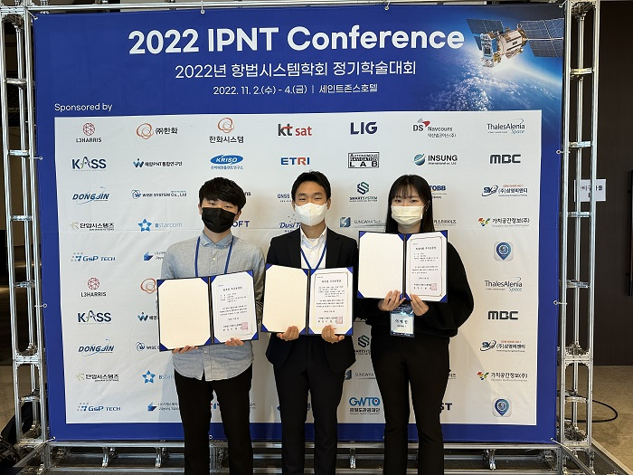

항공우주공학과 항법시스템 연구실 대학원생 및 학생들이 '2022년 항법시스템학회 정기학술대회(2022 IPNT Conference)'에서 우수 논문상을 대거 수상했다.

'사단법인 항법시스템학회'에서 주최한 이번 대회는 작년 11월 2일부터 4일까지 강릉 세인트존스 호텔에서 '한국형 위성 항법 시스템을 향한 첫걸음'이라는 주제로 진행되었다.

이예빈 대학원생(박사과정·21)은 우수 논문상을, 박아연(현 석사과정·23), 김성익(항공우주공학과·20), 조민형(항공우주공학과·20) 학생은 학부생 우수 논문상을 수상해 대회 내 가장 많은 수상자를 배출했다.

이예빈 대학원생은 위성항법보강시스템 운용 시 항법 오차 요소 별로 제공되는 보강 정보의 신뢰성을 보장하고 고장을 감시하기 위한 감시국 알고리즘을 제안하였으며, QZSS-CLAS 위성항법보강시스템에서 제공되는 보강 정보 및 실측 데이터를 이용하여 검증을 수행한 내용의 논문으로 우수 논문상을 수상했다.

박아연 학생은 큐브위성 SPIRONE의 TRIAD와 EKF를 활용한 자세 결정과 B-dot제어 및 LQR제어를 활용한 자세 제어를 설계하고 MATLAB에서 시뮬레이션을 수행한 내용의 논문으로 학부생 우수 논문상을 수상했다.

김성익 학생은 사전 궤도 정보 없이 위성 간 거리 측정치를 활용해 달 환경에서 적용 가능한 위성의 위치를 구하는 방법론을 제안하고, 지구 환경에서 시뮬레이션 결과를 얻어 방법론의 적합성을 판단하는 논문으로 학부생 우수 논문상을 수상했다.

조민형 학생은 차량 OBD를 통해 확인되는 속도의 측정치와 실제로 차량이 주행한 속도 사이의 Scale Factor를 Kalman Filter를 이용해 추정하고, Kinematic Vehicle Model과 INS의 측정치를 이용해 성능을 비교하는 내용의 논문으로 학부생 우수 논문상을 수상했다.

이예빈 대학원생 및 김성익·조민형 학생의 지도 교수인 박병운 교수는 '세종대가 항법과 초소형 위성 분야에서 전국 최상위권이라는 것은 늘 자부하고 있었는데, 이번 학회 최다 수상을 통해 입증됐다고 생각한다'며 '학생들이 즐겁고 열정적으로 연구를 하는 것을 보는 것만으로도 보람이 크고 더욱 힘을 낼 수 있는 동기가 부여된 것 같아 기쁘다'라고 말했다.

박아연 학생의 지도 교수인 김오종 교수는 '앞으로도 학생들과 함께 우리 사회의 발전에 기여할 수 있는 의미 있는 연구를 꾸준히 수행하도록 하겠다'라고 말했다.
