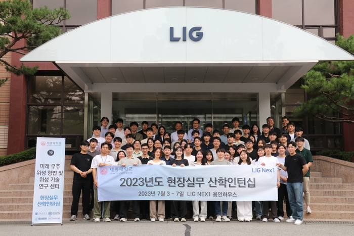
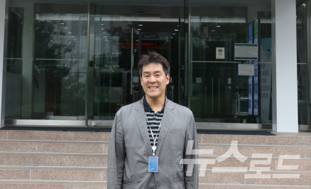
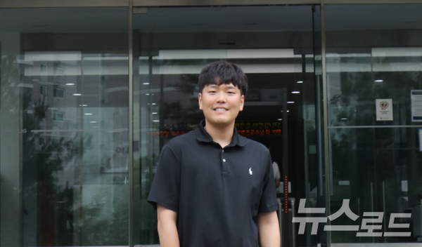
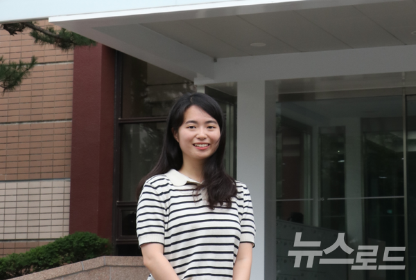

LIG넥스원(대표이사 김지찬)은 미래 우주분야 신기술을 선도할 전문인력 양성을 위해 산학인턴십을 지난 3일부터 오는 7일까지 5일간 LIG넥스원 용인하우스에서 진행중이다.

LIG넥스원 관계자는 "박병운 세종대 미래우주항법 및 위성기술연구센터 교수(센터장) 외 세종대, 서울대, 연세대, 홍익대 등 약 70여명의 학생들을 대상으로 특강을 비롯한 현장실무교육을 진행한다"며 5일 이같이 밝혔다.

이 관계자는 "이번 산학인턴십은 과기정통부가 주관하는 '미래우주교육센터' 사업 일환으로써 현장실무교육이 의무사항으로 포함되어 있다"면서 "4일에는 황홍연 LIG넥스원 C4ISTAR사업부문 연구위원의 '위성 시스템 엔지니어링'과 김수정 위성체계연구소 수석연구원의 '위성 시스템' 특강을 진행했다"고 전했다.

향후 교육일정에는 위성항법, 위성 SAR, 위성 통신 등의 주제로 LIG넥스원 임직원들의 특강과 현장 실무교육 등이 계획돼 있는 것으로 알려졌다.

▲박병운 교수 "우주작전 수행 기틀 마련...맞춤형 인재 양성에 최선 다할 것"

이번 LIG넥스원 산학인턴십에 참가한 교수와 학생들은 매우 긍정적인 반응을 보였다.

박병운 교수 [사진=LIG넥스원]

국내 위성항법분야 최고 전문가인 박병운 세종대 교수는 "우주작전 수행의 기틀을 마련하고 국가 우주개발계획 수립에 필요한 기업 맞춤형 인재 양성을 위해 최선을 다하겠다"며 참가 소감을 전했다.

윤정현 학생 [사진=LIG넥스원]

윤정현(세종대 대학원생) 학생은 "대한민국 대표 방산업체인 LIG넥스원의 산학인턴십에 참가할 수 있어 기쁘다"면서 "학교에서 쉽게 접하기 힘든 다양한 현장실무 경험과 지식을 쌓을 수 있는 귀중한 경험이 될 것 같다"고 말했다.

이하림 학생 [사진=LIG넥스원]

이하림(연세대 대학원생) 학생은 "위성항법 및 무인이동체에 대해 연구하고 있으나 이론적으로 공부한 내용들이 실제 산업계에서 어떻게 쓰이고 있는지 접할 기회가 많지 않았다"며 "이번 산학인턴십을 통해 세계 최고 기술력을 가진 LIG넥스원의 위성 관련 실무역량과 관련 내용을 접할 수 있어 좋았다. 학교에서 쉽게 접하기 힘든 다양한 현장실무 경험과 지식을 쌓을 수 있는 귀중한 경험이 될 것 같다"고 밝혔다.

한편, LIG넥스원은 앞서 지난해 6월 세종대와 함께 미래 우주분야 신기술을 선도할 전문인력 양성에 뜻을 모아 '우주전문 인력 양성을 위한 포괄적 협력 업무협약'을 맺은 바 있다.

또한 LIG넥스원은 세종대 국방시스템공학과 학생들이 좋은 환경에서 공부하고 졸업 후 미래의 해군장교로 성장할 수 있도록 작년 11월 세종대 광개토관 1층에 'LIG넥스원 강의실'을 구축하기도 했다.

세종대는 과학기술정보통신부의 '미래우주교육센터'와 방위사업청의 '방위산업 계약학과 지원사업' 주관대학으로 동시 선정된 전국 유일의 대학으로서 '미래우주항법 및 위성기술센터'를 운영 중이다. 서울대, 연세대, 홍익대, 카이스트 등이 함께 연구에 참여하고 있다.

김지찬 LIG넥스원 대표이사는 "LIG넥스원은 뉴 스페이스 시대를 맞이해 그동안 쌓아온 기술력을 기반으로 미래 국방우주력 발전을 강화하고 우주산업 생태계 활성화에 기여하겠다"며 "산학 인턴십에 참가한 학생들이 현장실무교육을 통해 우주산업에 대한 역량을 강화하기를 기대한다"고 말했다.

*출처: 뉴스로드*
