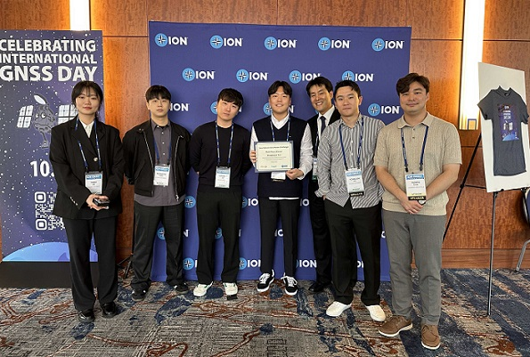

# 스마트폰 위치 오차 1m 내로 줄여라" … 세종대 박병운 교수팀, '구글 스마트폰 데시미터 챌린지' 세계 3위 올라

임정환 (뉴데이리 경제)기자

퀄컴 등 GNSS 칩셋 제조사보다 최대 75% 향상된 정확도 달성

윤정현 연구팀장, 최우수 프레젠테이션상 2관왕

▲ 세종대 우주항공시스템공학부 윤정현(가운데) 연구원과 박병운(오른쪽에서 세 번째) 교수가 연구팀원들과 기념촬영을 하고 있다.ⓒ세종대

세종대학교는 우주항공시스템공학부 박병운 교수 연구팀의 윤정현 박사과정생이 세계적인 IT 기업 구글과 국제위성항법시스템학회(ION)가 공동 주최한 '제3회 구글 스마트폰 데시미터 챌린지 2023-2024' 대회에서 세계 3위를 차지했다고 4일 밝혔다.

이번 행사는 세계 최대 규모의 스마트폰 기반 항법 경진대회로, 미국·중국·일본 등 전 세계 47개국에서 총 322개 팀의 위성항법 연구자가 참가했다. 시상식은 지난달 16~20일 미 볼티모어에서 열린 'ION GNSS+ 2024'에서 진행됐다.

스마트폰의 위치 정확도는 개방된 도로에선 5\~10m, 도심지에선 20\~100m 이상으로 큰 오차가 발생한다. 이번 대회는 이를 1m 이내로 개선하는 것을 목표로 한다. 구글은 미 샌프란시스코와 로스앤젤레스 일대의 도로와 도심 등 다양한 지역에서 얻은 196개의 스마트폰 주행 데이터를 제공했으며, 참가팀은 이를 활용해 위치정확도 향상에 도전했다.

박 교수 연구팀은 '2단계 속도 추정 기법을 활용한 스마트폰 위치 정확도 향상 기법'을 통해 위치 정확도를 높였다. 발표 세션에서 퀄컴, 브로드컴 등 세계적인 스마트폰 GNSS(범지구 위성항법시스템) 칩셋 제조사의 결과보다도 19~75% 향상된 정확도를 제시해 호평을 받았다. 그 결과 'ION GNSS+ 2024 최우수 프레젠테이션상'을 수상했다.

발표자로 나선 윤정현 연구팀장은 "세계 각국의 뛰어난 연구진과 경쟁할 수 있어 좋았다. 순위에 얽매이지 않고 실제 활용 가능한 기술 개발에 집중한 결과 (지난해에 이어) 최우수 프레젠테이션상을 받을 수 있었다"며 "연구에 아낌없는 조언을 주신 박병운 지도교수님께 감사드린다. 밤낮으로 함께 연구한 동료들과 이 영광을 나누겠다"고 소감을 전했다.

박 교수는 "위성항법은 스마트폰부터 우주 발사체와 위성에 이르기까지 사용되지 않는 분야를 찾기 어려울 만큼 중요한 핵심 기술"이라며 "이번 성과는 실무 위주의 교육과 연구를 중시한 연구실 철학의 산물로, 국내 스마트폰 제조사의 경쟁력 강화는 물론 한국형 위성항법시스템(KPS)과의 시너지 창출에도 크게 이바지할 것"이라고 말했다.

세종대 연구팀은 이번 대회 성과를 과학기술정보통신부·한국연구재단 주관으로 추진 중인 '미래 우주항법 및 위성기술 연구센터' 사업과 연계해 달에서 활용할 수 있는 위성항법시스템 연구로 확대한다는 계획이다.

<관련기사>
[조선일보]  세종대 우주항공시스템공학부 박병운 교수 연구팀, ‘Google Smartphone Decimeter Challenge’ 세계 3위에 올라
https://lifenlearning.chosun.com/pan/site/data/html_dir/2024/10/04/2024100400948.html

[디지털타임즈] 세종대 박병운 교수 연구팀, ‘Google Smartphone Decimeter Challenge’ 세계 3위
https://www.dt.co.kr/contents.html?article_no=2024100402109954088002&ref=naver
