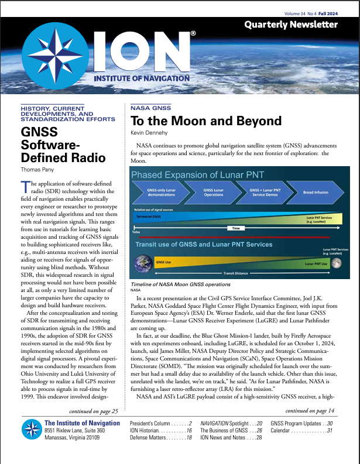
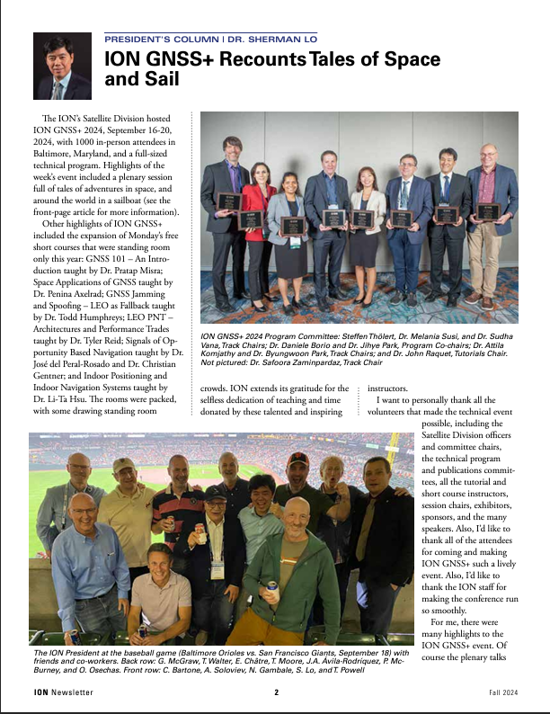
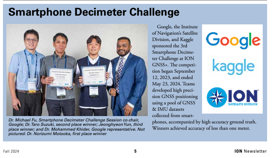
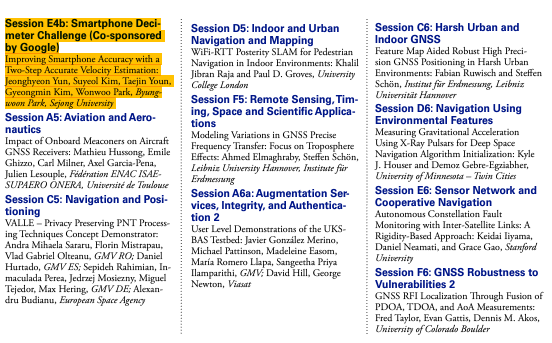

ION(Institute of Navigation) Quarterly Newsletter에 항법시스템 연구실의 주요 성과가 소개되었다.

박병운 교수는 ION GNSS+ 2024 Program Committee의 Track Chair로 활동하였다.

윤정현 박사과정생은 Google Smartphone Decimeter Challenge에서 세계 3위를 달성하였으며, ION GNSS+ 2024 Best Presentation Awards를 수상하였다.

