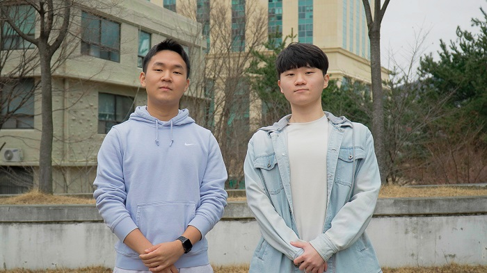

▲(왼쪽부터) 조민형ㆍ김성익 학생

'항법시스템학회 정기학술대회'는 국내 위성항법시스템 분야에서 가장 저명한 학술대회다. 우주항공공학전공 항법시스템 연구실 소속 김성익(석사과정·23), 조민형(항공우주공학과·20) 학생은 이 대회에서 2년 연속 우수 논문상을 수상했다. 국내 최고 학술대회에서 2년 연속으로 수상할 수 있었던 비결은 무엇이었을까? 두 학생을 만나 비결을 물었다.

---

### Q. 항법시스템학회 정기학술대회에 참가한 계기가 무엇인가?

> **(김성익)** 학술적으로 성장할 수 있는 큰 기회여서 참가했다. 이 학회는 항법시스템 분야에서 저명한 연구자뿐만 아니라 기업이나 외부 기관에서도 참여하므로 다양한 관점에서 논문에 대한 피드백을 받을 수 있다. 또한 국내 최고의 연구가 논의되는 행사라서 현재 어떤 연구가 이루어지고 있는지, 관심 있는 주제를 다른 연구자들은 어떻게 연구하고 있는지 등에 대해 공부할 수 있다.

---

### Q. 연구 주제는 어떠한 방식으로 선정하는가?

> **(조민형)** 보통 자신의 졸업 연구 주제에 맞는 주제와 과제를 교수님이 단계적으로 할당해 주신다. 예외적으로 연구실 내부에서 필요에 의해 주제를 선정하기도 한다. 부여된 주제가 관심 없는 분야일지라도 계속 공부를 이어나가려면 필요한 지식이기도 하고, 연구를 하면서 흥미를 찾는 경우도 있어서 주어진 주제에 성실히 임하는 편이다.

---

### Q. 어떠한 연구 방법과 프로세스를 적용 중인가?

> **(조민형)** 연구 주제가 선정되면 선행 논문을 조사한다. 담당 교수님이 매주 학생별로 개인 면담을 진행하시는데, 이때 이해되지 않는 부분들을 물어보거나 연구의 적합성을 점검한다. 또 논문을 통해 알게 된 이론을 토대로 코딩을 통해 구현한다. 연구 결과 또한 매주 면담 시간에 교수님에게 피드백을 받고, 다시 구현하면서 연구를 진행한다.

---

### Q. 수상하기 위해 어떠한 노력을 기울였는가?

> **(김성익)** 논문을 작성할 때는 최대한 직접 부딪혀보려고 노력했다. 선행 논문을 조사하다 보면 필요한 알고리즘이나 학술 지식을 쉽게 습득할 수 있다. 하지만 직접 해보지 않으면 모르는 것이나 마찬가지이므로 실제로 코드를 구현했다. 또한 발표는 연구의 필요성을 강조하고, 청중의 이해에 초점을 맞춰 구성하는 데 집중했다.

---

### Q. 대회 준비에 어려움은 없었는가?

> **(조민형)** 학회를 준비하다 보면 발표하기 전날까지 원하는 결과가 나오지 않는 경우가 많다. 특히 선행되지 않은 주제일 경우 답이 나오지 않으면 밤샘 작업을 하기 일쑤다. 이에 따라 체력적인 부담과 심리적인 압박이 크다. 하지만 발표가 끝난 후의 성취감이 매우 커서 모든 상황을 이겨낼 수 있지 않나 한다.

---

### Q. 앞으로의 계획은 무엇인가?

> **(김성익)** 위성보강시스템 분야에 종사하면서 우리나라 위성항법시스템인 KPS 구축에 많은 도움이 되고 싶다.

> **(조민형)** 일단 군 복무를 마친 후, 위성항법 연구에 다시 매진해 우리나라 위성항법시스템 발전에 기여하고 싶다.
