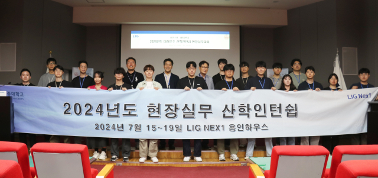

LIG넥스원과 세종대학교가 미래 우주 분야 신기술을 선도할 전문 인력 양성을 위해 손을 맞잡았다.

LIG넥스원은 15일부터 19일까지 LIG넥스원 용인하우스에서 산학 인턴십을 진행했다고 26일 밝혔다. 지난해부터 시작한 산학 인턴십은 과학기술정보통신부가 주관하는 '미래우주교육센터' 사업의 하나다.

이번 산학 인턴십에는 세종대와 홍익대에 재학 중인 대학원생들이 참여했다. 김종필 LIG넥스원 위성체계연구소장, 황홍연 미래전장연구개발본부 연구위원, 박병운 세종대학교 미래우주항법 및 위성기술연구센터장(교수)의 특강을 비롯해 다양한 현장 실무 교육 등이 진행됐다.

또한 '위성 개요·궤도'와 '위성 시스템'을 비롯한 위성통신, 위성항법, 위성 SAR(영상 레이더) 등의 주제로 LIG넥스원 임직원들의 특강과 현장 실무 교육도 진행했다.

세종대는 과학기술정보통신부의 '미래우주교육센터'와 방위사업청의 '방위산업 계약학과 지원사업' 주관대학으로 동시 선정된 전국 유일의 교육기관이다.

세종대는 2022년 서울대, 연세대, 홍익대, 카이스트 등과 함께 '미래우주항법 및 위성기술센터'를 개소해 초소형 위성, 달 환경에서의 위성궤도 결정 등 미래 우주 핵심 요소 기술 등의 핵심기술을 연구하고 있다.

박병운 교수는 "한국형 위성항법시스템(KPS) 개발은 물론, 달에서 거주하는 시대를 대비해 '달 항법 위성시스템'을 준비해야 하는 시기"라며 "K-방산을 넘어 K-우주를 향해 나아가는 대한민국의 미래를 책임질 기업 맞춤형 인재 양성을 위해 최선을 다하겠다"고 말했다.

김종필 LIG넥스원 위성체계연구소장은 "본격적인 뉴 스페이스 시대가 도래하며, 우주 분야에서도 인력·기술·자본 등의 중요성이 더없이 높아지고 있다"며 "앞으로도 세종대학교와의 긴밀한 협력을 기반으로 우주 분야 신기술을 선도할 전문 인력을 양성해 미래 국방 우주력 발전에 기여해 나갈 수 있도록 노력하겠다"고 말했다.
