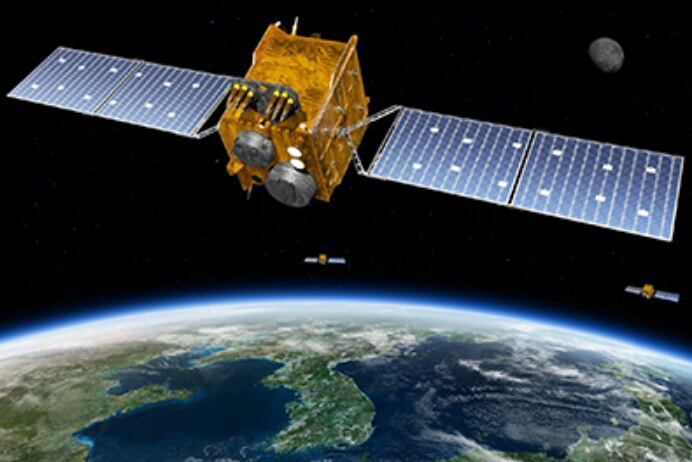

# [인터뷰] "달에서 사용할 GPS, 한국과 유럽이 함께 만들자"

에릭 모렐 유럽우주국(ESA) 국장우주청·ESA 협력 논의 본격 시작항법장치, 우주날씨 분야서 우선 협력 시작추후엔 달 항법 장치 공동 개발도 가능

한국형GPS(KPS) 위성의 임무 수행 상상도. 한국항공우주연구원

에릭 모렐 유럽우주국(ESA) 국장우주청·ESA 협력 논의 본격 시작항법장치, 우주날씨 분야서 우선 협력 시작추후엔 달 항법 장치 공동 개발도 가능

에릭 모렐 유럽우주국(ESA) 전략법무대외협력국장은 지난 15일 사천 우주항공청에서 조선비즈와 만나 "한국과 유럽이 협력해 달에서 사용할 수 있는 항법장치를 개발할 수 있을 것"이라고 말했다.

"지금은 각 기관이 추진하던 사업 간의 협력을 검토하고 있지만, 앞으로는 우주항공청(KASA)과 유럽우주국(ESA)이 새로운 프로젝트를 기획하는 것도 가능할 것이라고 확신한다. ESA는 여러 국가가 모여 운영하는 기관이다. 내부적으로도 협력을 통해 성장했으며, 일본과 미국 등 여러 국가의 우주 기관과 협력을 해왔다. 이번 방문을 계기로 한국과의 협력을 준비하고자 한다."

한국과 유럽이 우주 기술 개발, 우주 과학 연구를 위한 협력에 본격적으로 나선다. 유럽의 우주 개발을 총괄하는 유럽우주국(ESA)은 회원국 23곳이 모여 공동으로 운영하고 있다. 1975년 5월 공식적으로 출범해 올해로 50주년을 맞을 정도로 역사가 깊다. 미 항공우주국(NASA·나사)과 함께 현재 우주 개발을 이끄는 대표 기관이기도 하다.

ESA에서 전략과 법무, 대외협력 업무를 총괄하는 에릭 모렐(Eric Morel) 전략법무대외협력국장은 지난 15일 사천 우주항공청에서 조선비즈와 만나 "지난해 10월 우주항공청과 만나 이야기를 나누고, 지금이 한국과 협력을 시작하기에 적절한 시기라고 판단했다"며 "우주청을 출범해 우주 분야를 육성하려는 한국의 의지를 확인할 수 있었다"고 말했다.

모렐 국장은 한국과의 협력 분야에 대해 위성항법장치(GPS)와 우주 기상 분야를 꼽았다. 한국과 ESA가 각각 추진하던 프로젝트를 통해 시너지를 일으킬 수 있다는 의도로 풀이된다. 이번 협력이 잘 이뤄진다면 추후에는 달 거주 시대에 필요한 항법장치 개발도 한국과 할 수 있다는 구상도 공개했다.

그는 "앞으로 달에 사람이 진출하면 그 때 사용할 항법장치도 필요하다"며 "달 탐사를 위한 항법장치가 개발된다면 한국과 유럽뿐 아니라 달에 진출하는 모든 국가에 도움을 줄 수 있다"고 설명했다.

달 항법장치 개발은 지구에서 쓰이는 GPS 시스템 협력에서 시작될 것으로 보인다. 한국과 유럽은 각각 한국형 GPS(KPS), 갈릴레오로 불리는 독자적인 GPS 구축을 준비하고 있다. KPS는 정지궤도에 위성을 올려 한반도 인근 지역에서 사용할 수 있는 '지역 한정 GPS'다. 반면 갈릴레오는 지구 전역에서 사용할 수 있는 '글로벌 항법 위성 시스템(GNSS)'이다.

ESA는 갈릴레오 위성을 지구 저궤도(LEO)에 배치해 높은 정확도와 신호 강도를 높이는 방식을 채택했다. KPS 위성은 높은 고도의 지구 정지궤도(GEO)와 경사궤도에 위성을 배치한다. 비교적 적은 수의 위성으로도 24시간 한 지역의 위치 정보를 얻을 수 있는 방식이다.

국내에서도 KPS 위성을 LEO에 배치해 신호 강도를 높이고 전파 방해 공격에 대한 대응 능력을 키워야 한다는 의견이 나오기도 했다. 만약 한국과 유럽이 두 시스템 구축에서 협력을 한다면 각각의 장점을 살려 저렴한 비용으로 정확도 높은 GPS 시스템을 구축할 수 있다.

모렐 국장은 "한국과 유럽은 이미 항법장치 분야에서 강력한 협력 관계를 갖고 있다"며 "상호 운용성을 강화해 시스템의 품질을 높일 수 있다"고 말했다.

우주청이 추진하는 제4라그랑주점(L4) 탐사와 ESA가 추진하는 L5 탐사에서도 협력이 이뤄진다. 라그랑주점은 태양과 지구의 중력이 상쇄돼 일정한 위치를 유지할 수 있는 지역이다. 태양 활동을 각각 탐사선으로 장기간 관측 결과를 결합하면 우주날씨에 대한 예측 정확도를 높일 수 있다.

모렐 국장은 "각자 만든 탑재체를 공유해 여러 지역에서 같은 데이터를 수집하는 방식의 협력도 가능하다"며 "각자 프로젝트를 수행하는 것보다 더 많은 정보를 얻을 수 있는 방식"이라고 말했다.

ESA와 우주청은 오는 6월 업무협약(MOU)과 이행각서(IA)를 만들고, 이르면 오는 10월 고위급 회의를 통해 구체적인 협력 방안을 정할 계획이다. 그는 "ESA는 회원국들의 협력을 바탕으로 성장한 기관으로, 협력의 중요성에 대해 잘 알고 있다"며 "양자 간 협력으로 우주 기술과 함께 우주 산업을 육성할 수 있는 기회가 될 수 있을 것"이라고 말했다.

*출처: 조선비즈, 이병철 기자*
