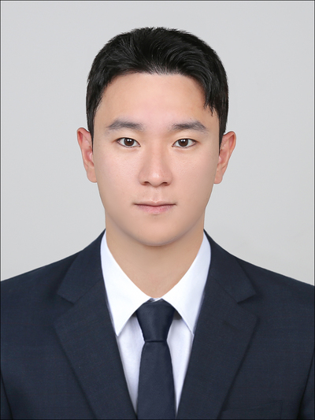
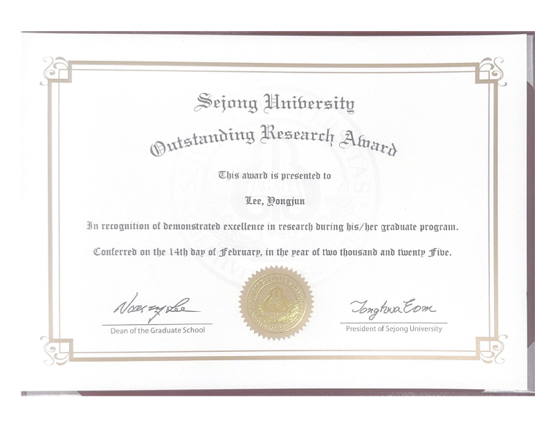

세종대학교 일반대학원에서 2025년 2월 박사학위를 취득한 이용준 박사가 뛰어난 연구 성과를 인정받아 'Outstanding Research Award'(공헌상)을 수상했다.

이 상은 SCI급 논문을 3편 이상 제1저자로 게재했거나, SCI 저널 상위 10% 이내 논문을 발표한 우수 연구자에게 수여되는 상으로, 이용준 박사는 SCI 상위 3% 이내 저널에 3편의 논문을 제1저자로 게재하며 학문적 기여를 인정받았다. 그는 도심지 환경에서 GNSS(위성항법시스템) 기반 위치 추정 연구를 수행하며, 다중경로 오차 극심 지역에서 정확한 위치 추정을 위해 새로운 기법을 적용하는 연구를 수행하였다.

이 박사는 세종대학교 항공우주공학과에서 학사, 석사, 박사 과정을 거치며 도심지 내 다중경로오차 감쇄를 통한 정확한 위치 측정 기술 개발에 매진해왔다. 그의 연구는 도심 항공 모빌리티(UAM) 및 차세대 네비게이션 시스템 발전에 중요한 역할을 할 것으로 기대된다.

이 박사는 수상 소감에서 "연구를 지도해 주신 박병운 교수님과 함께 노력해준 항법시스템 연구실 동료들에게 감사드리며, 앞으로도 위치기반 기술 발전에 기여할 수 있도록 노력하겠다"라고 밝혔다.

이용준 박사는 박사 학위 취득 이후, 한국전자통신연구원(ETRI) 에어모빌리티연구본부 도시·공간ICT연구실에서 연구원으로 재직하며 학위기간동안 수행했던 연구를 더욱 발전시킬 예정이다.
