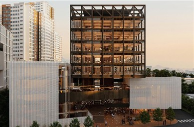

## 우주산업 육성계획 추진…미래산업 집적공간 '서울 테크 스페이스' 건립. 산학연 협의체 꾸려 인재육성·R&D 활성화…"우주경제 도시 서울 도약"

서울 테크 스페이스 조감도
[서울시 제공. 재판매 및 DB 금지]

(서울=연합뉴스) 김기훈 기자 = 서울시가 민간이 주도하는 뉴 스페이스(New Space) 시대에 대응하기 위해 '서울시 우주산업 육성계획'을 공식 추진한다. 서울시는 28일 민간기업, 학계, 연구기관 등이 참여하는 '우주산업 발전협의체'를 출범하고 서울형 도시기반 우주산업 전략 논의를 본격화했다고 밝혔다.

이번 우주산업 육성계획은 AI·바이오·로봇·반도체 등 첨단기술과 데이터 기반 산업 생태계를 바탕으로 민간 주도의 도시형 우주 경제로 도약하려는 전략의 하나로 마련됐다고 시는 소개했다. 시는 우선 구로구 고척동에 건립 예정인 '서울창업허브 구로'를 첨단제조·창업지원 기능을 기반으로 한 미래산업 집적공간 '서울 테크 스페이스'로 조성한다.

서울 테크 스페이스는 지하 3층∼지상 8층, 연면적 1만5천110㎡ 규모 첨단제조혁신 복합시설로, 기업의 연구개발부터 시제품 제작, 시험·검증, 사업화까지 전주기 지원이 가능한 복합 혁신거점으로 운영된다. 우주 영상데이터 등을 분석하고 사업화 모델을 개발할 수 있는 데이터랩 등의 공간도 구축할 계획이다. 시는 내년까지 설계를 마치고 2027년 착공, 2030년 개관이 목표다.

또 우주산업과 타 산업간 융합 컨설팅, 서울형 R&D 등을 통해 우주기업의 성장을 지원한다. 융합컨설팅은 AI·바이오 등 비(非) 우주기업의 우주산업 진입을 위해 기술상담, 융복합 R&D 매칭, 발주처 연계 등의 프로그램을 제공하는 사업이다. 첨단기술 기반의 우주 산업화와 우주기술의 첨단산업화를 촉진해 우주산업 영역이 확장될 것으로 기대된다.

첨단 우주제품 검증 및 AI 영상데이터 활용 사업화 모델 지원프로그램도 운영한다. 우주산업 생태계 활성화에도 힘을 쏟기로 했다. 시는 54개 대학과 글로벌 기업을 기반으로 우수 인력이 집중된 서울의 특성을 활용해 실무형 인재양성 프로그램을 운영하고, 전문인력 공급체계를 마련한다.산·학·연·관이 참여하는 우주산업 발전협의체를 구성해, 정책 자문과 기술 교류를 추진하고, 정기 포럼·세미나 등을 통해 협력 네트워크를 강화한다는 계획이다.

발전협의체에는 학계(서울대, 연세대, 건국대, 세종대, 서울시립대), 연구계(한국우주기술진흥협회, 한국항공우주산업협회, 한국항공우주연구원), 산업계(한화에어로스페이스·LIG넥스원, 보령, KTSAT, AP위성, 나라스페이스, 텔레픽스, 무인탐사연구소) 관계자 20여명이 참여한다.

이날 우주산업 발전협의체 1차 회의에서는 AI 기반 위성데이터 활용, 인재육성, 우주·AI·로봇·바이오 융합 등 서울형 우주산업 경쟁력 강화 방향이 논의됐다.

주용태 서울시 경제실장은 "서울은 국내 주요 대학과 연구기관, 혁신기업이 집적된 도시로, 우주산업 성장 잠재력이 매우 크다"며 "데이터·서비스 중심의 민간 주도 혁신 생태계를 구축하고, 기업과 인재가 함께 성장할 수 있는 우주경제 도시를 육성해 나가겠다"고 말했다.

kihun@yna.co.kr