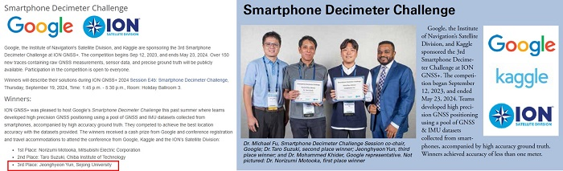
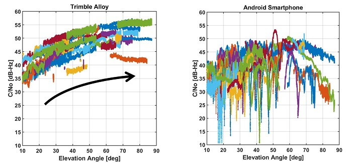
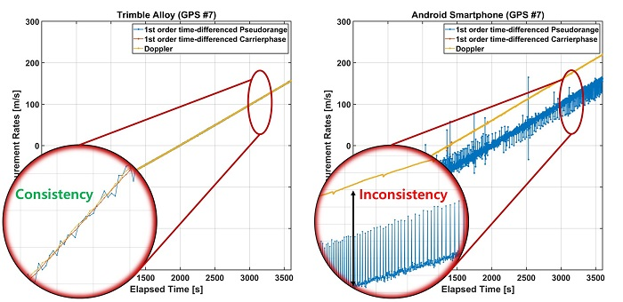
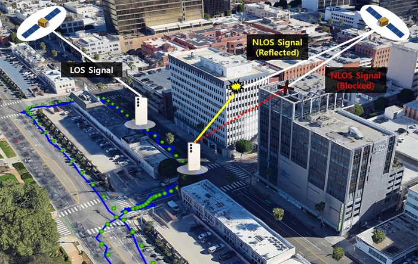
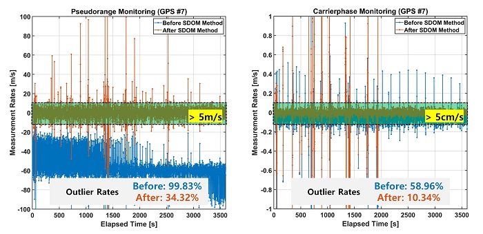
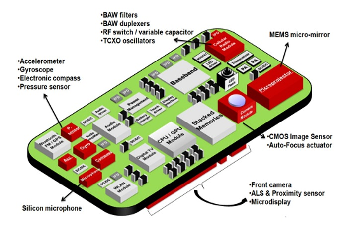
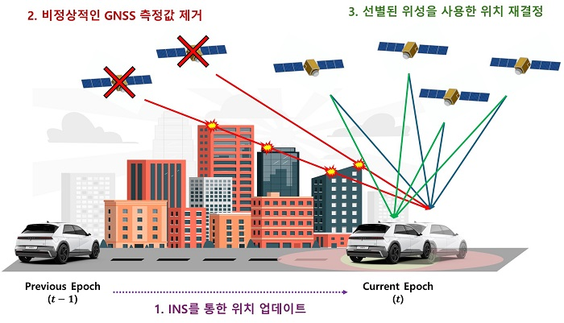
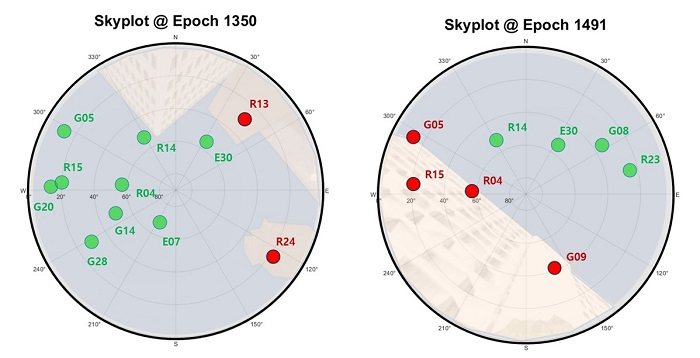
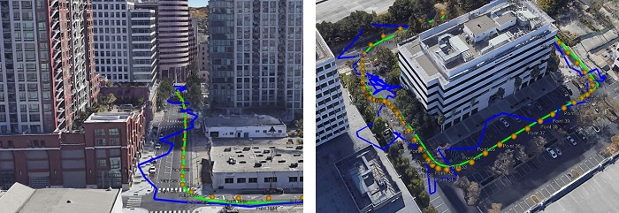

# 손 안의 정밀 위치 기술 : 스마트폰을 활용한 GNSS 정밀 측위의 현재와 미래

우주항공시스템공학부 박병운 교수, 윤정현 박사

---

## 1. 서론

스마트폰은 이제 단순한 통신 기기를 넘어, 위성항법시스템(Global Navigation Satellite System, GNSS)를 비롯한 다양한 센서와 위치 기반 서비스(Location-Based Service, LBS)를 통해 우리의 일상 전반을 변화시키고 있다. 전통적으로 지도 제작 및 지리 정보 시스템(GIS), 보행자 및 차량 내비게이션, 객체 추적, 교통 모니터링 및 계획에 사용되던 LBS는 최근 소셜 네트워킹, 안전 및 긴급 대응, 게임 및 스포츠 등 다양한 애플리케이션으로 확대되고 있으며 [1][2], 차량 호출 서비스, 증강현실(Augmented Reality, AR), 스마트시티 기반 서비스 등에서 초정밀 위치 정보에 대한 수요도 빠르게 증가하고 있다.

그러나, 우리가 일상에서 사용하는 스마트폰의 위치 정확도는 이러한 다양한 요구를 충족하기에는 턱없이 부족하다. 특히 건물이 밀집된 도심 지역과 같이 위치 정보가 중요한 환경에서는 오차가 수십 미터에 이르는 경우도 적지 않다 [3].

그림 1. 스마트폰 위치 기반 서비스의 다양한 응용 분야

업계 전문가들은 완전 자율주행(fully autonomous driving)과 같은 차세대 어플리케이션의 실현을 위해, GNSS가 20\~30cm 수준의 수평 위치 정확도를 달성하여야 한다고 전망한다 [4]. 이러한 산업계의 기대에 부응하고 차세대 서비스를 구현하기 위해서는, GNSS 기술의 고도화와 다양한 최신 센서들과의 융합을 통한 스마트폰 위치 정확도 향상이 필수적이다 [5]. 하지만 현재 스마트폰 GNSS 위치 정확도는 개방된 하늘(Open-sky) 환경에서도 5\~10m 수준에 머무르고 있으며, 장애물과 고층 건물이 밀집한 도시 환경에서는 오차가 100m 이상까지 증가하는 등, 현재의 기술으로는 정밀 측위가 필요한 미래 응용에 적용하기 어렵다는 한계가 존재한다 [6].

현재 스마트폰 GNSS의 위치 정확도는 Open-sky 환경에서 5\~10m, 도심지에서 20\~100m 이상인 반면, 차세대 응용이 요구하는 정확도는 Open-sky에서 20\~30cm, 도심지에서 1m 이내 수준이다.

---

## 2. 스마트폰 GNSS 기술의 구조적 한계

GNSS 수신 성능은 일반적으로 안테나 성능, 수신기 설계, 측정 주기 등 하드웨어적인 요소와 외부 신호 환경의 영향을 크게 받는다. 그러나 스마트폰은 기기 크기와 제조 단가, 배터리 수명 등의 제약으로 인해 전문 GNSS 장비에 비해 근본적인 구조적 한계를 안고 있다. 주요 한계는 다음과 같다.

### 한계 1: 저가형 안테나

첫째, 스마트폰은 고정밀 GNSS 신호 수신에 최적화되지 않은 저가형 안테나를 사용한다. 대부분의 스마트폰은 선형 편파(Linearly Polarized, LP) 안테나를 사용하는데, 이는 GNSS 위성 신호의 전파 특성인 오른손 원형 편파(Right-Hand Circularly Polarized, RHCP)에 비해 수신 효율이 떨어진다. GNSS 신호는 일반적으로 직접 경로(Line-of-Sight, LOS)를 따라 수신되지만, 도시와 같이 복잡한 환경에서는 건물이나 장애물에 의해 신호가 차단되거나 반사되면서[7] 다중 경로 오차(multipath)가 발생한다. 특히 비가시 경로(Non-LOS, NLOS) 환경에서는 직접 신호가 차단되고 반사된 신호만 수신되기 때문에 [8][9] 측위 오차가 커질 수 밖에 없다. 이러한 오차를 사전에 방지하기 위해 고가의 측지(surveying grade) 수신기들은 오른손 원형 편파(Right-Hand Circular Polarization, RHCP) 안테나를 사용하여 NLOS 반사 신호의 유입을 최소화한다. 또한, 고도각(elevation angle) 기반 Masking 기법이나 신호 대 잡음비(SNR) 필터링 기법을 적용하여 품질이 낮은 신호를 제거한다.

그림 2. 고도각에 따른 측지용 GNSS 수신기 및 스마트폰의 신호 세기 변화

그림 2에서 확인할 수 있듯이, 일반적으로 RHCP 안테나를 탑재한 수신기들은 위성 고도각이 증가할수록 SNR도 증가하는 경향을 보이지만, 스마트폰의 LP 안테나에서는 이러한 패턴이 뚜렷하지 않아 저품질 신호를 분리하거나 제거하기 어렵다. 그 결과, 수신 신호 분별의 모호성으로 인해 도심 고층 건물 사이에서 반사 신호나 비가시경로(NLOS, Non-Line-of-Sight)로 인한 측위 오차가 심화된다

### 한계 2: 듀티 사이클 방식의 간헐적 수신

스마트 폰은 배터리 사용 시간 최적화를 위해 GNSS 수신을 듀티 사이클 (duty cycle) 방식으로 수행하는 경우가 많다. 예를 들어, 1초 중 약 200ms 동안만 GNSS 칩셋이 작동하고 나머지 시간은 꺼지는 구조다. 이러한 간헐적 수신 방식은 반송파 위상 데이터의 연속성을 보장하지 못해, RTK(Real-Time Kinematic)나 PPP(Precise Point Positioning) 같은 고정밀 측위 기술의 적용을 어렵게 한다. 뿐만 아니라, GNSS raw 데이터 접근이 가능한 안드로이드 7.0 이상의 스마트폰에서도, 일부 제조사는 여전히 캐리어 위상 데이터 제공을 완전히 제공하지 않거나, 제공하더라도 신뢰할 수 없는 품질의 데이터를 포함하는 경우가 많다. 이러한 제한은 정밀 측위 기법의 실용화를 더욱 어렵게 한다.

### 한계 3: 시계 비동기성

스마트폰의 내부 시계(clock)는 위성 시스템 시각과 완전히 동기화되지 않아, 측정값 간 시계 오차가 발생하는 문제가 있다. 그림 3은 스마트폰이 GPS PRN 7 위성에서 수신한 시간차 의사거리 값의 변화를 보여주는데, 명백한 드리프트(drift)와 불연속(jump)이 발생함을 확인할 수 있다. 이는 일반적인 GNSS 수신기에서는 나타나지 않는 현상으로, 시간 오차로 인한 도플러 및 반송파 위상 측정값 간 일관성이 깨지게 되어 정확한 위치 계산에 방해가 된다. 

그림 3. 스마트폰 GNSS 측정치의 시계 비동기성

이와 같이, 스마트폰은 구조적 특성으로 인해 정상적인 GNSS 측정치 수신 환경에서도 일반 수신기보다 비정상적인 측정값을 수신할 가능성이 크며, 이는 정확도 저하로 직결된다. 특히, 도심지처럼 다중경로 및 NLOS 신호의 유입 가능성이 높은 환경에서는 그 영향은 더욱 두드러진다. 그림 4은 도심에서 LOS와 NLOS 신호가 혼재된 스마트폰의 수신 환경을 도식화한 것으로, 비정상적인 신호가 배제되지 않고 포함될 경우 사용자의 위치 추정에 심각한 영향을 줄 수 있음을 보여준다. 일반 GNSS 장비에서는 고도각 마스킹이나 SNR 필터링을 통해 이러한 신호를 일부 걸러낼 수 있지만, 스마트폰은 구조적인 제약으로 측지용 GNSS 수신기에 적용하던 기존 기법의 효과가 제한적이다. 따라서, 고도각이나 SNR 기준 없이도 비정상적인 측정값을 식별하고 제거할 수 있는 새로운 기법이 필요하다. 본 연구팀에서는 측정값 간의 일관성에 기반한 GNSS 이상값 탐지 기법과 MEMS 센서와의 통합 분석을 통한 스마트폰 측위 신뢰성과 정확성을 향상시키는 기술을 제안하여 적용하고 있다.

그림 4. 도시 환경의 스마트폰 GNSS 신호 수신 환경: 건물의 차폐 및 반사

---

## 3. 정밀 위치 서비스 개선: GNSS 기반 스마트폰 비정상 측정치 검출 방안

스마트폰의 GNSS 측정은 다양한 제약에도 불구하고, 신호 자체를 정밀하게 분석하고 비정상 측정값을 제거하는 방식만으로도 의미 있는 정확도 향상을 기대할 수 있다. 이 장에서는 스마트폰에 내장된 GNSS 측정값만을 활용해 측위 정확도를 높이는 세 가지 주요 기법, 즉 L5 신호 활용, 도플러 기반 필터링, 위성간 단일 차분 기반 이상값 감지(SDOM) 기법을 소개한다.

### 3.1 L5 신호 활용

L5 신호(GPS L5, Galileo E5)는 기존 L1 신호에 비해 칩 속도가 10배 빠르고, 파일럿 채널이 포함되어 긴 통합 시간을 허용한다. 이로 인해 다중경로 환경에 더 강하며, 측정 노이즈도 현저히 낮다.

L5 신호는 L1 대비 칩 속도가 10배 빠르고, 다중경로 내성이 높으며, 실제 실험에서 동일 위성 기준으로 L1보다 최대 60\~70% 낮은 위치 오차를 기록했다.

본 연구팀에서는 L1 보정값에 SBAS(위성 기반 보정 시스템)에서 제공하는 전리층 보정 정보를 적용하여 L5 보정값을 간접적으로 생성하는 방법을 제안하였다. 이 방식은 별도의 장비 확장 없이도 L5 신호의 활용도를 높일 수 있는 현실적인 대안이다.

### 3.2 도플러 기반 필터링

스마트폰 GNSS 반송파 측정치가 불안정하거나 제공되지 않는 상황에서는 도플러(Doppler) 데이터를 이용해 코드 측정치를 필터링할 수 있다 [14]. 도플러는 수신기와 위성 간 상대 속도에 기반한 측정값으로, 캐리어 위상보다 노이즈는 크지만 연속성이 뛰어나고, 대부분의 스마트폰에서도 안정적으로 수신된다.

실제로 도플러 기반 칼만 필터(Kalman Filter)를 적용한 실험에서는, 수평 위치 오차가 평균 1.2m, 수직 오차가 2.3m 수준으로 개선되었으며, 전체 측정값의 95%가 5m 이내의 정확도를 달성했다.

### 3.3 위성간 단일 차분 기반 이상값 감시 (SDOM)

가장 핵심적인 기법은 스마트폰에 특화된 SDOM(Single-Difference based Outlier Monitoring) 기법이다. 일반적인 GNSS 수신기는 모든 관측값이 동일한 수신기 시계를 기준으로 기록되지만, 스마트폰은 의사거리, 반송파 위상, 도플러 등의 측정값이 서로 다른 시계 소스를 기반으로 기록된다.

본 연구에서는 하나의 기준 위성과 다른 위성 간의 측정치 차이를 이용하여 수신기 시계의 불일치 영향을 제거하고, 실제 이상값만을 효과적으로 탐지할 수 있도록 한다. 위성간 단일 차분(∇)을 적용하면 수신기의 일시적 시계 오류도 두 위성간 차분에서 소거되기 때문에, 비정상적인 측정값만을 선별해 낼 수 있다.

그림 5. 위성간 단일 차분 (SDOM) 기법 적용 전/후 이상값 감지

그림 5는 GPS PRN 7 위성을 대상으로 SDOM 적용 전(파란색)과 후(주황색)의 이상 탐지 결과를 보여준다. 이상 탐지는 도플러 기반 예측값과 시간차 의사거리 및 반송파 위상 간의 차이를 기준으로 수행되었고, 임계값은 각각 5 m/s 및 5 cm/s로 설정되었다 [10][15]. SDOM 적용 전, 의사거리 모니터링 값의 99.83%가 이상값으로 탐지되었는데, 이 중 65.6%는 실제 이상값이 아닌 측정치별 시각 불일치로 인한 오탐지 결과였다. 과도한 오탐지 결과로 인한 유효 측정치 부족으로 정상적인 위치 계산이 불가능했다. 그러나 SDOM 적용 후, 시계 항 차이로 인한 영향이 해소되면서 오탐지률이 크게 줄고 유효한 측정값이 유지되어 정상적인 위치 계산이 가능해졌다. 오른쪽 그림의 반송파 위상 측정에서도 SDOM 적용 전에는 전체의 58.96%가 이상값으로 분류되으나, 적용 후에는 5 cm/s 임계값을 초과하는 이상값이 10.34%로 줄어들면서 실제 오류만 효과적으로 걸러낸 것으로 확인되었다. 이처럼 SDOM 기법은 스마트폰의 구조적 제약을 고려하여 고안된 이상값 감지 전략으로, 스마트폰 GNSS 측정의 신뢰성과 정확도를 획기적으로 개선할 수 있는 핵심 기술 중 하나로 평가된다.

---

## 4. 다중 센서 통합 시스템 기반 스마트폰 GNSS 오류 탐지 및 신뢰성 제고

대부분의 현대 스마트폰에는 GNSS 외에도 움직임, 방향, 환경 정보를 측정할 수 있는 다양한 센서들이 내장되어 있다 [11]. 대표적인 예로, 가속도계, 자이로스코프, 지자기 센서, 온습도 센서 등이 있다.

이 중, 가속도계 및 자이로스코프를 포함한 모션 센서를 결합하여 사용하는 INS(Inertial Navigation System, 관성 항법 시스템)는 외부 신호에 의존하지 않고 3차원 위치와 자세를 추정할 수 있다는 점에서 GNSS와 상호보완적이다. 특히 신호가 약하거나 차단된 실내, 수중, 도심 협곡, 심지어는 신호 간섭이 심한 지역에서도 연속적인 위치 추정이 가능하다.

예를 들어, 게임 앱은 중력 센서와 가속도계를 활용해 기울기, 흔들림, 회전, 휘두르기 등 복잡한 사용자 제스처와 동작을 해석하고, 지자기 센서와 가속도계를 이용하여 여행앱은 나침반 방향을 보정하기도 한다. 그림 6은 스마트폰에 탑재된 주요 MEMS(Micro Electro Mechanical Systems) 센서들의 구성을 보여준다 [12].

그림 6. 스마트폰 MEMS 센서 구조 [12]

이 중, 가속도계 및 자이로스코프를 포함한 모션 센서는 기기의 움직임과 자세를 측정하는 데 핵심적인 역할을 한다. 가속도계는 중력을 고려하여 선형 가속도를 측정하고, 자이로스코프는 회전 속도를 측정한다. 이 센서들을 결합하여 사용하는 INS(Inertial Navigation System, 관성 항법 시스템) 위치 측정은 외부 신호에 의존하지 않고 3차원 위치와 자세를 추정할 수 있다는 점에서 GNSS와 상호보완적이다. 특히 신호가 약하거나 차단된 실내, 수중, 도심 협곡, 심지어는 신호 간섭이 심한 지역에서도 연속적인 위치 추정이 가능하다는 장점이 있다. INS는 초기 위치를 기준으로, 시간에 따라 측정된 가속도와 회전 속도를 적분하여 상대 위치를 계산한다. 다만 장기간 사용할 경우 누적 오차가 커질 수 있으므로, GNSS와 결합하여 INS의 상대 위치 추정을 GNSS의 절대 위치 정보로 보정하는 방식이 일반적이다.

그림 7. INS를 사용한 비정상적인 GNSS 측정값 제거 방법

본 연구팀은 GNSS와 INS의 측위 영역 약결합(Loosely-Coupled) 대신 측정치 영역에서의 강결합(Tightly-Coupled) 방식을 사용하였다. 그림 7에 제시된 바와 같이 INS 항법 시스템을 통해 위치를 예측하고, 예측된 위치와 GNSS 측위 결과를 비교한 후, 비정상적인 위성의 측정값을 제거하는 방법을 사용하였다. 특히, 시간이 지남에 따라 INS 누적오차가 발산하는 위협을 감소하기 위하여 지자기 센서와 고도계 정보도 함께 사용하였으며, 사용자의 운동 특성을 반영하여 센서간 통합을 adaptive하게 수행하였다.

알고리즘의 첫 단계는 위성의 항법 데이터와 강결합 (Tightly-coupled) 기반의 확장 칼만 필터 (Extended Kalman Filter, EKF)를 사용해 이전 시점의 추정 위치를 계산한다. 다음으로, 이전 시점에 추정된 위치로부터 INS 기구화(INS mechanization)를 적용하여 의사거리(Pseudorange)와 도플러의 예상치를 계산한다. 이후, 실제 GNSS로부터 수신된 의사거리 및 도플러 측정값과 INS 예측치를 비교하여 오차가 일정 임계값 이상이면 해당 위성의 측정값은 이상값으로 간주하고 제거한다. 마지막으로 이상 위성 제거후 선별된 정상 위성만을 활용해 최종 위치를 재결정한다. 이를 통해 GNSS 단독일 경우보다 더욱 신뢰성 높은 위치 추정이 가능해진다.

그림 8. 강결합 기반 GNSS/INS 시스템을 통한 LOS 및 NLOS 위성 판별 결과

그림 8은 제안된 방법인 강결합 기반 GNSS/INS 알고리즘을 실제 도심 환경에 적용한 결과로, 차량에 탑재된 스마트폰으로 수집한 GNSS 데이터를 기반으로 각 위성의 LOS (녹색) 및 NLOS (적색) 여부를 분류한 것이다. 실제 건물 배치에 투영시킨 스카이 플롯을 살펴보면, 1350초 시점에 R13 (GLONASS 13)과 R24 (GLONASS 24) 위성이 NLOS으로 판정되었고, 실제 실험 차량의 동쪽에 높은 건물이 존재하였다는 것을 확인할 수 있다. 실제 건물 배치를 고려했을 때 이 결과는 매우 일관적이며, 알고리즘의 타당성을 입증해준다. 또한, 1491초 시점의 남서 방향에 있던 4개의 위성 (G05, G09, R04, R15) 위성의 경우에도 NLOS 위성으로 판별되었으며, 이 역시 실제 건물에 의해 가려진 영역에 해당되었다. 

결과적으로 INS 기반의 예측 위치 정보를 통해 GNSS 이상 측정값을 제거하고, 양질의 위성만 선별하여 위치를 재결정하는 방식은, 스마트폰 사용자에게 더 안정적이고 신뢰도 높은 위치 기반 서비스를 제공하는 데 매우 효과적인 전략임을 보여준다.

---

## 5. 실험 및 검증: 스마트폰 데시미터 챌린지 3위 수상

앞서 소개한 기법들의 실효성을 입증하기 위해, 본 연구팀은 구글에서 주최한 스마트폰 데시미터 챌린지(Google Smartphone Decimeter Challenge, GSDC)의 공개 데이터를 활용하여 알고리즘 성능 평가를 수행하였다. GSDC는 Google, ION(Institute of Navigation), 그리고 데이터 분석 플랫폼 Kaggle이 공동 주최한 대규모 국제 경진대회로, 스마트폰만을 활용해 데시미터(수십 cm) 수준의 위치 정확도를 달성하는 기술 개발을 목표로 한다.대회는 2021년부터 매년 개최되었으며, 참가자들은 다양한 스마트폰 모델과 도시 환경에서 수집된 GNSS/IMU 데이터를 활용해 정밀한 위치 추정 알고리즘을 개발해야 했다.

그림 9. 세종대학교 항법시스템 연구실 연구팀 – 스마트폰 데시미터 챌린지 3위 수상 (출처, 좌: ION 공식 홈페이지, 우: ION News Letter)

2021년, 2022년 그리고 2023-2024 시즌까지 총 세 차례 개최된 이 대회는 학계와 산업계로부터 큰 주목을 받았으며, 3년 동안 전 세계에서 총 1,662개 팀, 1,991명의 참가자가 스마트폰 기술의 한계를 극복하기 위해 참여하였다 [13]. 그림 9와 같이 세종대학교 항법시스템연구실 연구팀은 가장 최근 대회인 2023-2024년 대회에서 322개 팀 중 3위를 차지하였으며, 스마트폰만으로도 데시미터 수준의 정확도를 달성할 수 있는 가능성을 입증하였다. 

연구팀은 스마트폰으로부터 수신한 GNSS/IMU 원시 데이터를 기반으로, 도플러 기반 속도 예측 및 위치 업데이트, TDCP(Time-Differenced Carrier Phase) 기반 속도 보정, 위성간 단일 차분 기반 이상값 제거(SDOM), INS 보조 기반 NLOS 위성 필터링의 복합 측위 알고리즘을 구현하여 적용하였으며, 그 결과 최종 Kaggle 점수(50% 및 95% 위치 오차 평균 기준) 기준으로 Public set는 평균 0.89m, Private set는 평균 1.19m의 결과를 획득하였다. 특히 듀얼 주파수 GNSS(L1/L5)를 지원하는 고사양 스마트폰에서는 수평 오차가 0.3m, 수직 오차는 0.4m 수준으로 매우 높은 수준의 정확도를 달성하였다. L1 단일 주파수 기반 스마트폰에서도 약 1.5m 수준의 위치 정확도를 기록해, 알고리즘의 범용성과 실용성을 함께 입증하였다. 한편, 1위와 2위 수상자는 정해진 주행 루트 정보와 제공된 파일 기반 데이터셋의 이점을 활용하여 후처리(post-processing) 방식으로 결과를 도출한 반면, 세종대 연구팀은 ‘forward-only’ 방식, 즉 실시간 처리에 근접한 조건에서 알고리즘을 구현하였다. 따라서, 본 연구팀이 달성한 데시미터 수준의 결과는 실시간 서비스에도 동일할 것으로 기대된다. 

그림 10은 실제 주행경로 (주황색)상 스마트폰 GNSS 측위 결과를 비교한 것으로, Google이 제공한 위치 정보 (청색)에 포함된 오차들이 세종대학교 항법시스템연구실 (녹색) 연구팀의 알고리즘 적용으로 오차가 제거되어 실제 주행 궤적에 매우 근접해 진 것을 확인할 수 있다.

그림 10. 스마트폰 GNSS 측위 결과 비교 – 세종대학교 항법시스템연구실 연구팀(녹색), Google이 제공한 위치 정보 (청색) & 실제 주행경로 (주황색) 

---

## 6. 결론
스마트폰 GNSS 기술은 오늘날 다양한 위치 기반 서비스의 핵심 기술로 자리잡고 있으며, 그 활용 범위는 지속적으로 확장되고 있다. 최근에는 자율주행 차량, 스마트시티 인프라, 정밀 농업, 실내외 혼합 내비게이션, C-ITS(Collaborative Intelligent Transport Systems) 등, 데시미터급 정확도가 요구되는 첨단 응용 분야에서도 스마트폰 기반 측위 기술의 활용 가능성이 주목받고 있다. 그러나 현재 스마트폰 GNSS의 위치 정확도는 개방된 하늘(Open-sky) 환경에서도 약 5\~10m 수준에 머물고 있으며, 건물이 밀집한 도심 환경에서는 100m 이상의 오차도 발생할 수 있는 한계가 있다.

이러한 오차의 가장 큰 원인은 스마트폰이 구조적으로 저품질 안테나, 연속성 부족한 측정 환경, 낮은 신호 감도, 시계 비동기성 등 여러 제약 조건 하에서 GNSS 측정값을 수신한다는 점이다. 특히, 이러한 조건은 비정상적인 GNSS 측정값을 발생시키며, 이를 식별하고 제거하지 않는 한 정밀한 위치 추정은 사실상 불가능하다.

본 연구에서는 이와 같은 구조적 한계를 극복하고자, GNSS 측정값 기반의 이상값 제거 알고리즘, INS(IMU 기반 관성항법 시스템)과의 융합, 위성 신호 품질 분류 및 필터링 기법 등을 통합적으로 활용하여, 스마트폰에서도 데시미터급 정밀 위치 정보 제공이 가능함을 실험적으로 입증하였다.

특히 Google과 ION이 공동 주최한 스마트폰 데시미터 챌린지(GSDC)에서 세종대학교 항법시스템연구실 연구팀이 세계 3위를 수상하며, 스마트폰 기반 GNSS 측위 기술의 세계적 경쟁력을 보여주었다. 본 연구팀의 알고리즘은 실시간 처리 기반으로 개발되었기 때문에, 향후 실용적 측면에서도 큰 가능성을 갖고 있다. 

이러한 연구 결과는 스마트폰을 활용한 정밀 측위 기술이 단지 실험적 가능성에 머무르지 않고, 자율주행, 드론 내비게이션, 증강현실(AR), 고정밀 위치 공유 서비스 등 차세대 공간정보 응용 분야에 실질적으로 적용될 수 있는 수준에 도달하였음을 보여준다. 특히, 본 연구진이 달성한 성과는 글로벌 시장에서 널리 사용되는 Qualcomm Snapdragon 플랫폼의 측위 성능을 능가하는 수준으로, 국내 스마트폰 제조사와 GNSS 관련 산업의 기술 자립과 국제 경쟁력 제고에 크게 기여할 것으로 기대된다. 

앞으로는 누구나 사용하는 스마트폰 한 대만으로도 본 연구진이 달성한 데시미터급을 넘어 센티미터급 정확도의 위치 기반 서비스를 누릴 수 있는 시대가 도래할 것이며, 본 연구는 그 변화를 현실로 앞당기는 중요한 이정표가 되기를 소망한다.

---

## 참고문헌

[1] F. van Diggelen, W. Roy, and W. Wang, "How to achieve 1-meter accuracy in Android," GPS World, Jul. 2018.

[2] J. Paziewski, "Recent advances and perspectives for positioning and applications with smartphone GNSS observations," Meas Sci Technol, vol. 31, no. 9, Sep. 2020.

[3] M. M. Farhad, M. Kurum, and A. C. Gurbuz, "A Ubiquitous GNSS-R Methodology to Estimate Surface Reflectivity Using Spinning Smartphone Onboard a Small UAS," IEEE J Sel Top Appl Earth Obs Remote Sens, vol. 16, 2023.

[4] F. Zangenehnejad and Y. Gao, "GNSS smartphones positioning: advances, challenges, opportunities, and future perspectives," Satellite Navigation, vol. 2, no. 1, Nov. 2021.

[5] P. Dabove and V. Di Pietra, "Towards high accuracy GNSS real-time positioning with smartphones," Advances in Space Research, vol. 63, no. 1, Jan. 2019.

[6] G. (Michael) Fu, M. Khider, and F. van Diggelen, "Android Raw GNSS Measurement Datasets for Precise Positioning," ION GNSS+ 2020, Oct. 2020.

[7] G. A. McGraw, P. D. Groves, and B. W. Ashman, "Robust Positioning in the Presence of Multipath and NLOS GNSS Signals," in Position, Navigation, and Timing Technologies in the 21st Century, Wiley, 2020.

[8] Y. Lee and B. Park, "Nonlinear Regression-Based GNSS Multipath Modelling in Deep Urban Area," Mathematics, vol. 10, no. 3, Jan. 2022.

[9] Y. Lee, P. Wang, and B. Park, "Nonlinear Regression-Based GNSS Multipath Dynamic Map Construction and Its Application in Deep Urban Areas," IEEE Transactions on Intelligent Transportation Systems, 2023.

[10] J. Yun, C. Lim, and B. Park, "Inherent Limitations of Smartphone GNSS Positioning and Effective Methods to Increase the Accuracy Utilizing Dual-Frequency Measurements," Sensors, vol. 22, no. 24, Dec. 2022.

[11] J. Yun and B. Park, "A GNSS/Barometric Altimeter Tightly Coupled Integration for Three-Dimensional Semi-Indoor Mapping With Android Smartphones," IEEE Geoscience and Remote Sensing Letters, vol. 21, 2024.

[12] Y. Wang, N. Li, X. Chen, and M. Liu, "Design and Implementation of an AHRS Based on MEMS Sensors and Complementary Filtering," Advances in Mechanical Engineering, vol. 6, Jan. 2014.

[13] A. Chow, D. Orendorff, M. Fu, M. Khider, S. Dane, and V. Gulati, "Google Smartphone Decimeter Challenge 2023-2024," Kaggle, 2023.

[14] B. Park, C. Lim, Y. Yun, E. Kim, and C. Kee, "Optimal Divergence-Free Hatch Filter for GNSS Single-Frequency Measurement," Sensors, vol. 17, no. 3, Feb. 2017.

[15] J. Yun, C. Lim, B. Park, and J. Morton, "Detecting Ionospheric Irregularity Based on ROT Variation Using Android Devices Cloud System," ION GNSS+ 2020, Oct. 2020.
